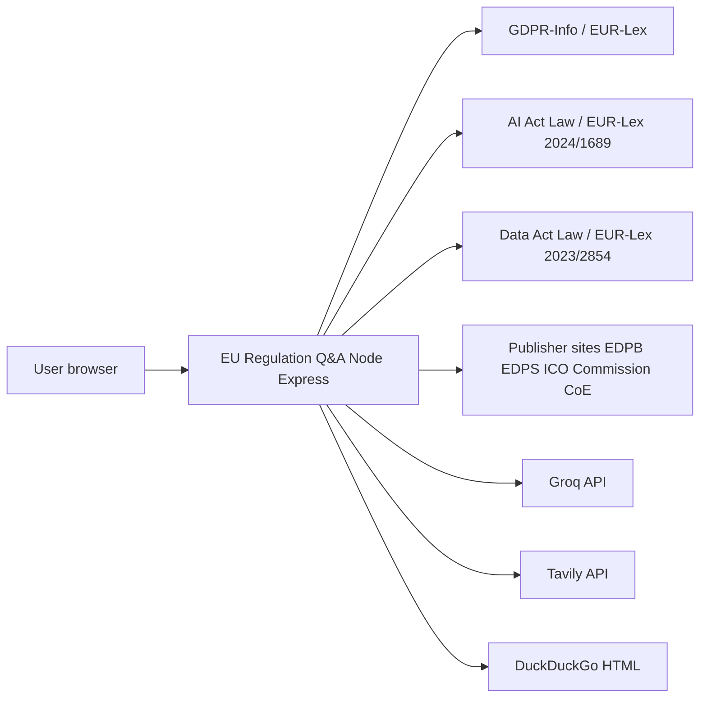
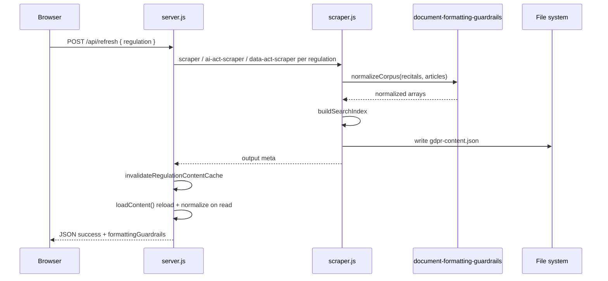
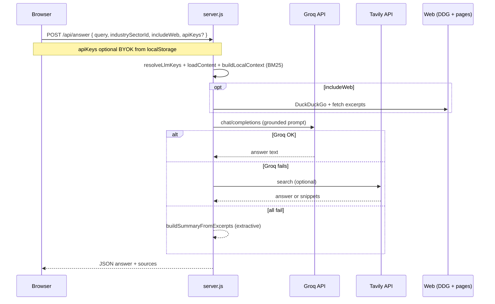
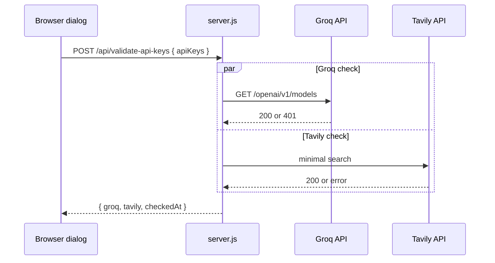

# Architecture overview  
## EU Regulation Q&A Platform

**Version:** 1.5 · **Last updated:** 2026-05-19 · Documentation standard **v2.1** · Product **1.2.3**

## System context

---

## Logical architecture

| Layer | Components | Responsibility |
|-------|------------|----------------|
| **Client** | `index.html`, `app.js`, `regulation-profiles.js`, `news-dedupe.js`, `styles.css` | `#appChrome` (sticky header + tabs ≤899px); **Tools** panel; `syncHeaderToolbarStatus`; News hero; regulation switcher; tabs; regulation-aware Ask/Sources/News/Browse |
| **API** | `server.js` | REST; `parseRegulationId`; BM25; Groq/Tavily with `regulationSearchContext` |
| **Registry** | `lib/regulations.js`, `lib/regulation-content.js`, `lib/paths.js` | Regulation metadata; `loadContent(regId)`; Vercel `/tmp` |
| **ETL GDPR** | `scraper.js` + **`document-formatting-guardrails.js`** | → **`gdpr-content.json`** |
| **ETL AI Act** | `ai-act-scraper.js` | → **`ai-act-content.json`** |
| **ETL Data Act** | `data-act-scraper.js` | → **`data-act-content.json`** |
| **News** | `news-crawler.js`, `news-topics.js`, `server.js` (merge, dedupe, routes), `public/news-dedupe.js` | Parallel fetches (RSS/HTML/API) → relevance gate → topic assignment → merge → **consolidated dedupe** → API + client mirror |
| **Crossrefs** | `gdpr-crossrefs.js` | Article↔recital suitability and citation extraction |
| **Data** | `data/*.json`, `public/industry-sectors.json` | Corpus, news cache, chapter summaries, sectors |

---

## Regulation refresh pipeline (sequence)

---

## Ask pipeline (sequence)

---

## Deployment model

- **Local / VM** — One Node.js process (`npm start`) serves API and static files; `node-cron` runs daily regulation ETL at 02:00 Europe/Brussels.
- **Vercel** — Express app exported via `api/index.js`; all routes rewrite to that function; bundled `data/` is seeded into `/tmp/gdpr-qa-data` per instance (`lib/paths.js`). Daily ETL uses Vercel Cron → `api/cron/daily-regulation-refresh.js` with `CRON_SECRET`. See [VERCEL_DEPLOY.md](VERCEL_DEPLOY.md).
- **Stateful files (local)** — `data/` should persist on disk between restarts (content + news cache). On Vercel, treat committed `data/` as source of truth; `/tmp` writes are ephemeral.
- **Secrets** — Environment variables only; no database required for core features. BYOK keys stay in the browser.

---

## BYOK validation (sequence)

---

## Extension points

- **New LLM provider for Ask:** Extend `server.js` with a parallel path to Groq/Tavily (keep citation contract).
- **BYOK providers:** Extend **`resolveLlmKeys`** and validation helpers; never persist client keys server-side.
- **Additional news sources:** Implement fetch/parser in `news-crawler.js` and add feed metadata to defaults or JSON.
- **Sector list:** Edit `public/industry-sectors.json` (and optional server copy if split later).

---

## References

- [API_CONTRACTS.md](API_CONTRACTS.md)  
- [VARIABLES.md](VARIABLES.md)  
- [README.md §8 Project structure](../README.md#8-project-structure)
