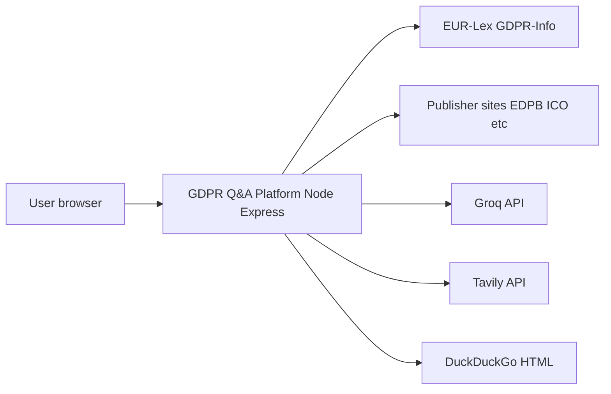
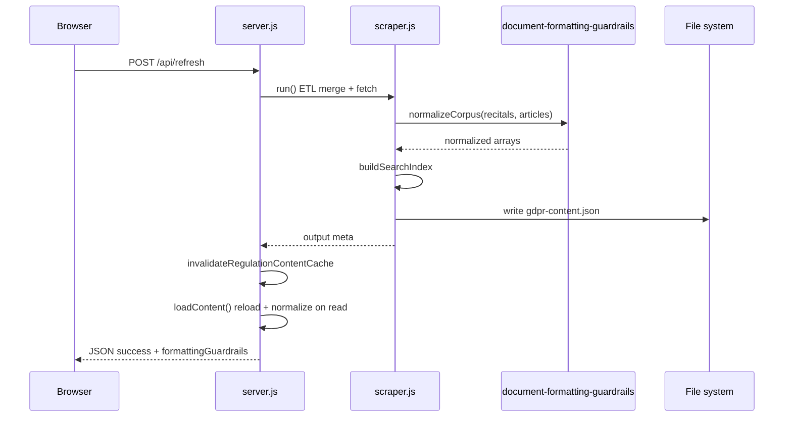
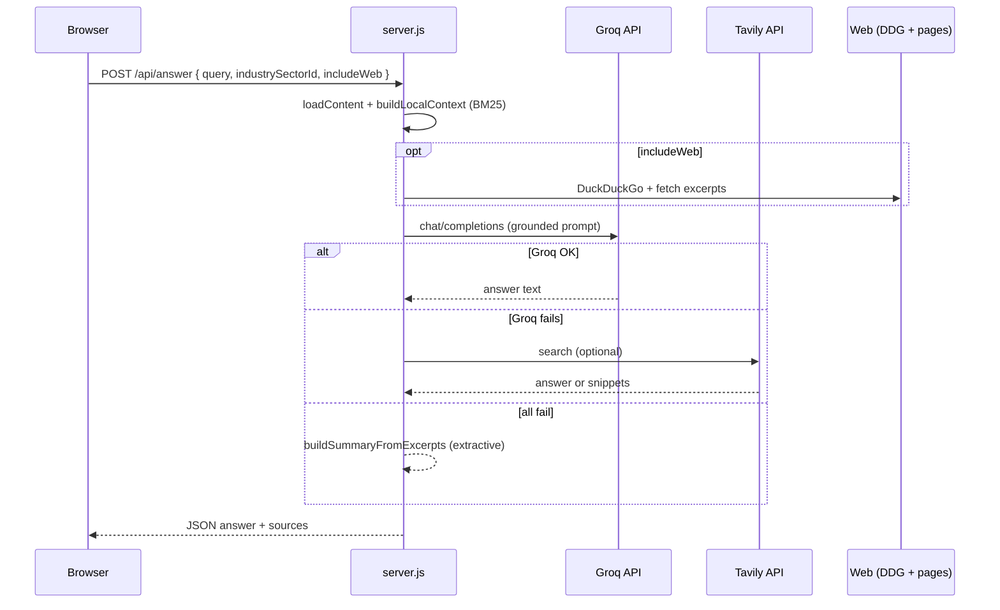

# Architecture overview  
## GDPR Q&A Platform

## System context

---

## Logical architecture

| Layer | Components | Responsibility |
|-------|------------|----------------|
| **Client** | `public/index.html`, `public/app.js`, `public/styles.css` | Tabs, browse reader, Ask composer, news/sources UI, PDF export |
| **API** | `server.js` | REST endpoints, content load, BM25 retrieval, LLM orchestration, news merge |
| **ETL** | `scraper.js` + **`document-formatting-guardrails.js`** | Fetch and parse regulation → **`normalizeCorpus`** → **`buildSearchIndex`** → **`gdpr-content.json`** |
| **News** | `news-crawler.js` | Fetch listings → items merged in server |
| **Crossrefs** | `gdpr-crossrefs.js` | Article↔recital suitability and citation extraction |
| **Data** | `data/*.json`, `public/industry-sectors.json` | Corpus, news cache, chapter summaries, sectors |

---

## Regulation refresh pipeline (sequence)

---

## Ask pipeline (sequence)

---

## Deployment model

- **Single process** — One Node.js server serves API and static files.
- **Stateful files** — `data/` directory should persist on disk between restarts (content + news cache).
- **Secrets** — Environment variables only; no database required for core features.

---

## Extension points

- **New LLM provider for Ask:** Extend `server.js` with a parallel path to Groq/Tavily (keep citation contract).
- **Additional news sources:** Implement fetch/parser in `news-crawler.js` and add feed metadata to defaults or JSON.
- **Sector list:** Edit `public/industry-sectors.json` (and optional server copy if split later).

---

## References

- [API_CONTRACTS.md](API_CONTRACTS.md)  
- [VARIABLES.md](VARIABLES.md)  
- [README.md §8 Project structure](../README.md#8-project-structure)
