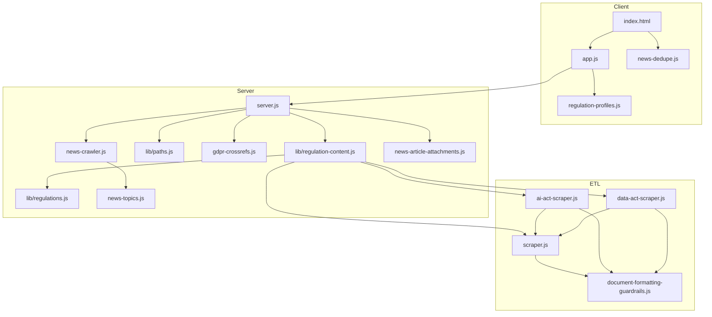

# Source code inventory  
## EU Regulation Q&A Platform

**Version:** 1.6 · **Last updated:** 2026-07-06 · Documentation standard **v2.3** · Product **1.2.4** (code cleanup **1.2.5**)

Repository file map, **public module APIs**, and simplified dependency overview. For architecture diagrams, see [ARCHITECTURE.md](ARCHITECTURE.md).

Authoritative **file-by-file** map of the repository (excluding `node_modules/`, `.git/`). Use with [README §8](../README.md#8-project-structure) and [ARCHITECTURE.md](ARCHITECTURE.md).

---

## 1. Root application

| Path | Type | Responsibility |
|------|------|----------------|
| `server.js` | Backend | Express app: regulation APIs, Ask, news, refresh, cron hooks, static SPA |
| `scraper.js` | ETL | GDPR corpus from GDPR-Info / EUR-Lex |
| `ai-act-scraper.js` | ETL | EU AI Act corpus from ai-act-law.eu |
| `data-act-scraper.js` | ETL | EU Data Act corpus from data-act-law.eu |
| `document-formatting-guardrails.js` | Library | Normalize + validate corpus on read/write |
| `gdpr-crossrefs.js` | Library | Article↔recital suitability merge helpers |
| `news-crawler.js` | ETL | Multi-source news crawl and merge |
| `news-topics.js` | Library | Topic taxonomy, classification, crawl gate |
| `news-article-attachments.js` | Library | SSRF-safe attachment scan for news article URLs |
| `package.json` | Config | Scripts, dependencies, engine ≥18 |

### 1.1 Public module exports (Node)

| Module | Exported symbols | Consumers |
|--------|------------------|-----------|
| `server.js` | `app`, `runRegulationScraperAndReloadContent` | `api/index.js`, `api/cron/daily-regulation-refresh.js` |
| `scraper.js` | `run`, `fetchText`, `buildSearchIndex`, `stripLeadingHeadingLinesFromBody`, `mergeWithExisting`, `getGdprInfoEntryPlainText`, `computeDatasetHash` | `server.js`, `lib/regulation-content.js`, AI/Data Act scrapers |
| `ai-act-scraper.js` | `run` | `lib/regulation-content.js`, CLI |
| `data-act-scraper.js` | `run` | `lib/regulation-content.js`, CLI |
| `document-formatting-guardrails.js` | `normalizeCorpus`, `validateCorpusFormatting`, `logFormattingGuardrailsReport` | Scrapers, `lib/regulation-content.js`, `server.js` |
| `gdpr-crossrefs.js` | `buildRecitalsCitingArticlesMap`, `mergedSuitableRecitalsForArticle`, `mergedSuitableArticlesForRecital` | `server.js` |
| `news-crawler.js` | `crawlNews`, `withTimeout`, `normalizeNewsUrlKey`, `dedupeNewsItemsConsolidated`, `sanitizeNewsItemDates` | `server.js` |
| `news-topics.js` | `NEWS_TOPIC_FALLBACK`, `assignNewsTopicFields`, `mergeNewsItemTopicFields`, `getTopicTaxonomyForClient`, `getFlatTopicLabelsInOrder`, `newsBlobMatchesTopicAnchor` | `server.js`, `news-crawler.js` |
| `news-article-attachments.js` | `fetchNewsArticleAttachments` | `server.js` |

**Note:** Internal helpers (e.g. `fetchUrl`, `parseEurLexText` in `scraper.js`; granular normalizers in `document-formatting-guardrails.js`) are **not** exported. Import only documented symbols (**TG-C01** in [GUARDRAILS.md](GUARDRAILS.md)).

---

## 2. `lib/`

| Path | Responsibility |
|------|----------------|
| `lib/regulations.js` | Regulation registry (`gdpr`, `ai-act`, `data-act`): paths, limits, feature flags |
| `lib/regulation-content.js` | `loadContent`, cache, `parseRegulationId`, refresh orchestration |
| `lib/paths.js` | `getDataDir()`, Vercel `/tmp` seeding |

### 2.1 `lib/regulations.js` — public API

| Export | Purpose |
|--------|---------|
| `normalizeRegulationId(id)` | Coerce query/body id to `gdpr` \| `ai-act` \| `data-act` |
| `getRegulation(id)` | Full registry object for one regulation |
| `listRegulations()` | API-safe list for `GET /api/regulations` (includes `hasArticleTopics`, `hasSuitableRecitals`) |
| `getRegulationPaths(id)` | Resolved filesystem paths under `getDataDir()` |
| `enrichArticlesWithChapter(articles, chapterRanges)` | Attach `chapter` index to articles (ETL) |

**Internal (not exported):** `REGULATIONS` constant, `REGULATION_DISPLAY_ORDER`. Feature flags live on registry objects:

| Regulation | `hasArticleTopics` | `hasSuitableRecitals` |
|------------|-------------------|----------------------|
| `gdpr` | `true` | `true` |
| `ai-act` | `false` | `false` |
| `data-act` | `false` | `false` |

### 2.2 `lib/paths.js` — public API and Vercel seed

| Export | Purpose |
|--------|---------|
| `getDataDir()` | Writable data directory (`data/` locally; `/tmp/gdpr-qa-data` on Vercel) |
| `IS_VERCEL` | `Boolean(process.env.VERCEL)` — gates tmp seeding |

**`SEED_FILES` (internal)** — copied from bundled `data/` to `/tmp` on first cold start when destination missing:

1. `gdpr-content.json`
2. `gdpr-structure.json`
3. `ai-act-content.json`
4. `ai-act-structure.json`
5. `data-act-content.json`
6. `data-act-structure.json`
7. `gdpr-news.json`
8. `chapter-summaries.json`
9. `chapter-summaries-ai-act.json`
10. `chapter-summaries-data-act.json`
11. `article-suitable-recitals.json`

Override writable root with `GDPR_DATA_DIR`. See [VERCEL_DEPLOY.md](VERCEL_DEPLOY.md).

### 2.3 `lib/regulation-content.js` — public API

| Export | Purpose |
|--------|---------|
| `parseRegulationId(req)` | Read `regulation` from query or body |
| `loadContent(regulationId)` | Cached corpus + `buildSearchIndex` on read |
| `invalidateRegulationContentCache(regulationId)` | Bust in-memory cache after ETL |
| `runRegulationScraperAndReloadContent(regulationId)` | Run scraper + reload |
| `listRegulations()` | Re-export from `lib/regulations.js` |
| `getRegulationPaths(id)` | Re-export from `lib/regulations.js` |

---

## 3. `api/` (Vercel)

| Path | Responsibility |
|------|----------------|
| `api/index.js` | Serverless Express entry (`module.exports = require('../server')`) |
| `api/cron/daily-regulation-refresh.js` | Scheduled multi-regulation ETL (GDPR + AI Act + Data Act); `CRON_SECRET` auth |

---

## 4. `public/` (frontend)

| Path | Responsibility |
|------|----------------|
| `public/index.html` | SPA shell: `#appChrome`, Tools panel, **`#browseWelcomeGrid`** / **`#browseWelcome`**, **`#chaptersFiltersToggle`** / panel, **`#newsSections`**, News hero, app credits |
| `public/app.js` | Browse, Ask, Sources, News, BYOK; regulation chrome; chapters filter panel; reader formatting |
| `public/styles.css` | Design tokens, app chrome, browse welcome themes, News hero themes, reader layout |
| `public/regulation-profiles.js` | Per-regulation UI: `askUi`, `sourcesUi`, `newsUi`, `browseUi`, `citationsUi`, URLs |
| `public/news-dedupe.js` | Client mirror of `dedupeNewsItemsConsolidated` (`GDPR_NEWS_DEDUPE`) |
| `public/industry-sectors.json` | ISIC sector list for Ask |
| `public/industry-sector-tree.json` | Hierarchical sector tree |
| `public/article-suitable-recitals.json` | GDPR editorial crossrefs (prestart copy) |

### 4.1 Removed legacy client symbols (2026-07-06)

The following were removed as dead code; **no user-facing feature loss**:

| Removed | Reason |
|---------|--------|
| `openChapter()` | No call sites; chapter browsing uses grouped list + article detail |
| `buildClientSummary()` | Ask error path never invoked it |
| `normalizeAnswerText()` | Unused; `formatAnswerHtml` handles display |
| `renderNumericSublist()` | Deprecated wrapper with zero callers |
| `#newsList` flat list path | Replaced by `#newsSections` grouped UI |

### 4.2 Removed legacy CSS (2026-07-06)

`.chapter-view*`, `.chapter-card`, `.browse-welcome-hint`, legacy `.qa-*` / `.chat-*` / `.result-card` Ask blocks, hidden `.news-filter-label` rules.

---

## 5. `data/` (persisted)

| Path | Regulation / domain |
|------|---------------------|
| `data/gdpr-structure.json` | GDPR structure + credible sources |
| `data/gdpr-content.json` | GDPR full corpus |
| `data/ai-act-structure.json` | AI Act structure + credible sources |
| `data/ai-act-content.json` | AI Act full corpus |
| `data/data-act-structure.json` | Data Act structure + credible sources |
| `data/data-act-content.json` | Data Act full corpus |
| `data/gdpr-news.json` | News feeds + items (shared across regulations) |
| `data/article-suitable-recitals.json` | GDPR editorial crossrefs |
| `data/chapter-summaries.json` | GDPR chapter intros |
| `data/chapter-summaries-ai-act.json` | AI Act chapter intros |
| `data/chapter-summaries-data-act.json` | Data Act chapter intros |

---

## 6. `scripts/`

| Path | Responsibility |
|------|----------------|
| `scripts/fetch-article-suitable-recitals.js` | Refresh GDPR suitable-recitals map (`npm run fetch-suitable-recitals`) |
| `scripts/generate-industry-sectors-isic.js` | Maintainer one-off: regenerate `public/industry-sectors.json` |

---

## 7. Configuration and deploy

| Path | Responsibility |
|------|----------------|
| `.env.example` | Documented environment template |
| `vercel.json` | Vercel routes, cron, build |
| `.vercelignore` | Deploy exclusions |

---

## 8. Documentation (see [docs/README.md](README.md))

All product docs live under `docs/` plus root `README.md`, `PRODUCT_DOCUMENTATION_STANDARD.md`, `CHANGELOG.md`.

---

## 9. Dependency graph (simplified)

