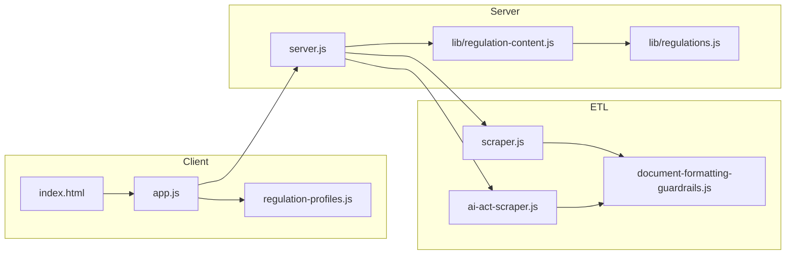

# Source code inventory  
## EU Regulation Q&A Platform

**Version:** 1.2 · **Last updated:** 2026-05-19 · Documentation standard **v1.8** · Product **1.2.0**

Repository file map and simplified dependency overview. For architecture diagrams, see [ARCHITECTURE.md](ARCHITECTURE.md).

Authoritative **file-by-file** map of the repository (excluding `node_modules/`, `.git/`). Use with [README §8](../README.md#8-project-structure) and [ARCHITECTURE.md](ARCHITECTURE.md).

---

## 1. Root application

| Path | Type | Responsibility |
|------|------|----------------|
| `server.js` | Backend | Express app: regulation APIs, Ask, news, refresh, cron hooks, static SPA |
| `scraper.js` | ETL | GDPR corpus from GDPR-Info / EUR-Lex |
| `ai-act-scraper.js` | ETL | EU AI Act corpus from ai-act-law.eu |
| `data-act-scraper.js` | ETL | EU Data Act corpus from data-act-law.eu |
| `document-formatting-guardrails.js` | Library | Normalize + validate corpus on read/write |
| `gdpr-crossrefs.js` | Library | Article↔recital suitability and citation extraction |
| `news-crawler.js` | ETL | Multi-source news crawl and merge |
| `news-topics.js` | Library | Topic taxonomy, classification, crawl gate |
| `package.json` | Config | Scripts, dependencies, engine ≥18 |

---

## 2. `lib/`

| Path | Responsibility |
|------|----------------|
| `lib/regulations.js` | Regulation registry (`gdpr`, `ai-act`, `data-act`): paths, limits, flags |
| `lib/regulation-content.js` | `loadContent`, cache, `parseRegulationId`, refresh orchestration |
| `lib/paths.js` | `getDataDir()`, Vercel `/tmp` handling |

---

## 3. `api/` (Vercel)

| Path | Responsibility |
|------|----------------|
| `api/index.js` | Serverless Express entry |
| `api/cron/daily-regulation-refresh.js` | Scheduled multi-regulation ETL (GDPR + AI Act + Data Act) |

---

## 4. `public/` (frontend)

| Path | Responsibility |
|------|----------------|
| `public/index.html` | SPA shell, tabs, regulation selector, app credits bar |
| `public/app.js` | Browse, Ask, Sources, News, BYOK, regulation chrome |
| `public/styles.css` | Design tokens, layout, components |
| `public/regulation-profiles.js` | Per-regulation UI copy and URLs |
| `public/news-dedupe.js` | Client news dedupe mirror |
| `public/industry-sectors.json` | ISIC sector list for Ask |
| `public/industry-sector-tree.json` | Hierarchical sector tree |
| `public/article-suitable-recitals.json` | GDPR editorial crossrefs (prestart copy) |

---

## 5. `data/` (persisted)

| Path | Regulation / domain |
|------|---------------------|
| `data/gdpr-structure.json` | GDPR structure |
| `data/gdpr-content.json` | GDPR full corpus |
| `data/ai-act-structure.json` | AI Act structure + credible sources |
| `data/ai-act-content.json` | AI Act full corpus |
| `data/gdpr-news.json` | News feeds + items |
| `data/article-suitable-recitals.json` | GDPR crossrefs |
| `data/chapter-summaries.json` | GDPR chapter intros |
| `data/chapter-summaries-ai-act.json` | AI Act chapter intros |
| `data/data-act-structure.json` | Data Act structure + credible sources |
| `data/data-act-content.json` | Data Act full corpus |
| `data/chapter-summaries-data-act.json` | Data Act chapter intros |

---

## 6. `scripts/`

| Path | Responsibility |
|------|----------------|
| `scripts/fetch-article-suitable-recitals.js` | Refresh GDPR suitable-recitals map |

---

## 7. Configuration and deploy

| Path | Responsibility |
|------|----------------|
| `.env.example` | Documented environment template |
| `vercel.json` | Vercel routes, cron, build |
| `.vercelignore` | Deploy exclusions |

---

## 8. Documentation (see [docs/README.md](README.md))

All product docs live under `docs/` plus root `README.md`, `PRODUCT_DOCUMENTATION_STANDARD.md`, `CHANGELOG.md`.

---

## 9. Dependency graph (simplified)

