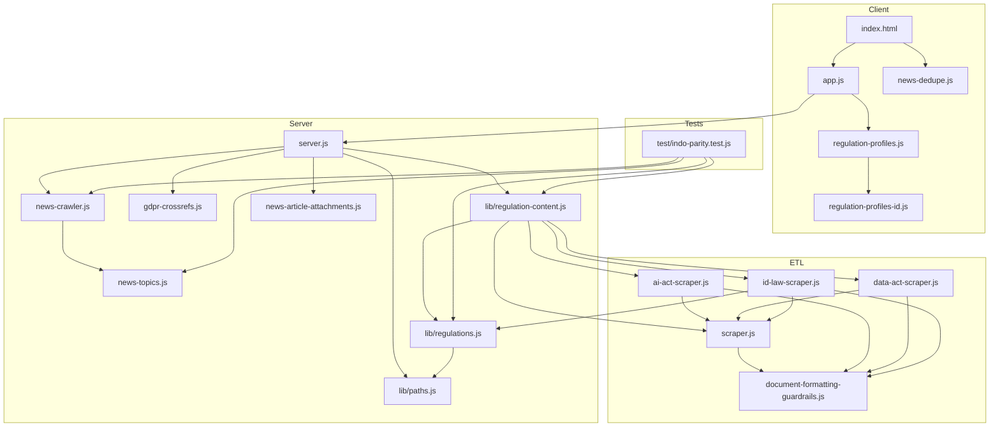

# Source code inventory  
## Regulation Q&A Platform

**Version:** 2.0 · **Last updated:** 2026-10-20 · Documentation standard **v2.5** · Product **1.2.6** · Audit date **2026-10-20**

Repository file map, **public module APIs**, and simplified dependency overview for **six instruments** (EU: `gdpr`, `ai-act`, `data-act`; Indonesia: `id-pdp`, `id-satu-data`, `id-ai-ethics`). For architecture diagrams, see [ARCHITECTURE.md](ARCHITECTURE.md).

Authoritative **file-by-file** map of the repository (excluding `node_modules/`, `.git/`). Use with [README §8](../README.md#8-project-structure) and [ARCHITECTURE.md](ARCHITECTURE.md).

---

## 1. Root application

| Path | Type | Responsibility |
|------|------|----------------|
| `server.js` | Backend | Express app: regulation APIs, Ask (`POST /api/answer` only), news, refresh, cron hooks, static SPA |
| `scraper.js` | ETL | GDPR corpus from GDPR-Info / EUR-Lex; shared ETL helpers reused by all other scrapers |
| `ai-act-scraper.js` | ETL | EU AI Act corpus from ai-act-law.eu |
| `data-act-scraper.js` | ETL | EU Data Act corpus from data-act-law.eu |
| **`id-law-scraper.js`** | ETL | **Indonesian corpora** (`id-pdp`, `id-satu-data`, `id-ai-ethics`): live JDIH HTML check (`Pasal` parsing), bundled-official corpus preferred when live extract is thin; CLI `node id-law-scraper.js <id>` |
| `document-formatting-guardrails.js` | Library | Normalize + validate corpus on read/write — applies to **all six** corpora including those written by `id-law-scraper.js` |
| `gdpr-crossrefs.js` | Library | GDPR article↔recital suitability merge helpers |
| `news-crawler.js` | ETL | Multi-source news crawl and merge; EU publishers + **`crawlIndonesiaOfficialNews`** (Antara tag hubs/RSS, Komdigi, Setkab, data.go.id) |
| `news-topics.js` | Library | Topic taxonomy (EU + Indonesia categories), classification, crawl gate |
| `news-article-attachments.js` | Library | SSRF-safe attachment scan for news article URLs |
| `package.json` | Config | Version **1.2.6**; scripts (`start`, `refresh*`, `test`, …); dependencies; engine ≥18 |
| `package-lock.json` | Config | Locked dependency tree |
| `vercel.json` | Config | Rewrites, function limits, `includeFiles`, cron schedule |
| `.vercelignore` | Config | Deploy exclusions: `.env`, `.env.*` (except `.env.example`), `node_modules`, `*.log`, `.DS_Store`, `.cursor` |
| `.gitignore` | Config | `node_modules/`, `.env`, `*.log`, `.DS_Store`, `.vercel`, `tmp-id-etl/` |
| `.env.example` | Config | Documented environment template (no secrets) |
| `CHANGELOG.md`, `README.md`, `PRODUCT_DOCUMENTATION_STANDARD.md` | Docs | Root documentation set; see §8 |

### 1.1 Public module exports (Node)

| Module | Exported symbols | Consumers |
|--------|------------------|-----------|
| `server.js` | `app` (default), `runRegulationScraperAndReloadContent` | `api/index.js`, `api/cron/daily-regulation-refresh.js` |
| `scraper.js` | `run`, `fetchText`, `buildSearchIndex`, `stripLeadingHeadingLinesFromBody`, `mergeWithExisting`, `getGdprInfoEntryPlainText`, `computeDatasetHash` | `server.js`, `lib/regulation-content.js`, AI/Data Act and **Indonesian** scrapers |
| `ai-act-scraper.js` | `run` | `lib/regulation-content.js`, CLI |
| `data-act-scraper.js` | `run` | `lib/regulation-content.js`, CLI |
| **`id-law-scraper.js`** | `run(regulationId)` | `lib/regulation-content.js` (`id-pdp`, `id-satu-data`, `id-ai-ethics`), CLI |
| `document-formatting-guardrails.js` | `normalizeCorpus`, `validateCorpusFormatting`, `logFormattingGuardrailsReport` | All scrapers, `lib/regulation-content.js`, `server.js` |
| `gdpr-crossrefs.js` | `buildRecitalsCitingArticlesMap`, `mergedSuitableRecitalsForArticle`, `mergedSuitableArticlesForRecital` | `server.js` |
| `news-crawler.js` | `crawlNews`, **`indonesiaPolicyNewsRe`**, **`indonesiaNewsItemIsOnScope`**, `withTimeout`, `normalizeNewsUrlKey`, `dedupeNewsItemsConsolidated`, `sanitizeNewsItemDates` | `server.js`, `test/indo-parity.test.js` (`crawlIndonesiaOfficialNews` is internal to `crawlNews`) |
| `news-topics.js` | `NEWS_TOPIC_FALLBACK`, `assignNewsTopicFields`, `mergeNewsItemTopicFields`, `getTopicTaxonomyForClient`, `getFlatTopicLabelsInOrder`, `newsBlobMatchesTopicAnchor` | `server.js`, `news-crawler.js`, `test/indo-parity.test.js` |
| `news-article-attachments.js` | `fetchNewsArticleAttachments` | `server.js` |

**Note:** Internal helpers (e.g. `fetchUrl`, `parseEurLexText` in `scraper.js`; `parsePasalFromPlainText`, `fetchJdihDataset` in `id-law-scraper.js`; granular normalizers in `document-formatting-guardrails.js`) are **not** exported. Import only documented symbols (**TG-C01** in [GUARDRAILS.md](GUARDRAILS.md)).

---

## 2. `lib/`

| Path | Responsibility |
|------|----------------|
| `lib/regulations.js` | Six-entry regulation registry (`gdpr`, `ai-act`, `data-act`, `id-pdp`, `id-satu-data`, `id-ai-ethics`): paths, limits, `jurisdiction`, feature flags, `REGULATION_DISPLAY_ORDER` |
| `lib/regulation-content.js` | `loadContent`, cache, `parseRegulationId`, refresh orchestration (ETL dispatch incl. `id-law-scraper`) |
| `lib/paths.js` | `getDataDir()`, Vercel `/tmp` seeding (`SEED_FILES`) |

### 2.1 `lib/regulations.js` — public API

| Export | Purpose |
|--------|---------|
| `normalizeRegulationId(id)` | Coerce query/body id to one of the six ids (unknown ⇒ `gdpr`) |
| `getRegulation(id)` | Full registry object for one regulation |
| `listRegulations()` | API-safe list for `GET /api/regulations` in display order (includes `hasArticleTopics`, `hasSuitableRecitals`, `jurisdiction`, `jurisdictionLabel`, `officialSiteName`) |
| `getRegulationPaths(id)` | Resolved filesystem paths under `getDataDir()` |
| `enrichArticlesWithChapter(articles, chapterRanges)` | Attach `chapter` index to articles (ETL and load) |
| `ID_REGULATION_IDS` | `Set` of the three Indonesian ids (`id-pdp`, `id-satu-data`, `id-ai-ethics`) |

**Internal (not exported):** `REGULATIONS` constant, `REGULATION_DISPLAY_ORDER`. Feature flags and jurisdiction live on registry objects:

| Regulation | Jurisdiction | `hasArticleTopics` | `hasSuitableRecitals` | `etlEnvPrefix` | Max articles / recitals / chapters |
|------------|:------------:|:------------------:|:---------------------:|----------------|-------------------------------------|
| `gdpr` | `eu` | `true` | `true` | `GDPR` | 99 / 173 / 11 |
| `ai-act` | `eu` | `false` | `false` | `AI_ACT` | 113 / 180 / 13 |
| `data-act` | `eu` | `false` | `false` | `DATA_ACT` | 50 / 119 / 11 |
| `id-pdp` | `id` | `false` | `false` | `ID_PDP` | 76 / 4 / 16 |
| `id-satu-data` | `id` | `false` | `false` | `ID_SATU_DATA` | 44 / 4 / 8 |
| `id-ai-ethics` | `id` | `false` | `false` | `ID_AI_ETHICS` | 7 / 9 / 5 |

### 2.2 `lib/paths.js` — public API and Vercel seed

| Export | Purpose |
|--------|---------|
| `getDataDir()` | Writable data directory (`data/` locally; `/tmp/gdpr-qa-data` on Vercel) |
| `IS_VERCEL` | `Boolean(process.env.VERCEL)` — gates tmp seeding |

**`SEED_FILES` (internal, 20 files)** — copied from bundled `data/` to `/tmp` on first cold start when destination missing:

| # | File | # | File |
|---|------|---|------|
| 1 | `gdpr-content.json` | 11 | `id-ai-ethics-content.json` |
| 2 | `gdpr-structure.json` | 12 | `id-ai-ethics-structure.json` |
| 3 | `ai-act-content.json` | 13 | `gdpr-news.json` |
| 4 | `ai-act-structure.json` | 14 | `chapter-summaries.json` |
| 5 | `data-act-content.json` | 15 | `chapter-summaries-ai-act.json` |
| 6 | `data-act-structure.json` | 16 | `chapter-summaries-data-act.json` |
| 7 | `id-pdp-content.json` | 17 | `chapter-summaries-id-pdp.json` |
| 8 | `id-pdp-structure.json` | 18 | `chapter-summaries-id-satu-data.json` |
| 9 | `id-satu-data-content.json` | 19 | `chapter-summaries-id-ai-ethics.json` |
| 10 | `id-satu-data-structure.json` | 20 | `article-suitable-recitals.json` |

Override writable root with `GDPR_DATA_DIR`. See [VERCEL_DEPLOY.md](VERCEL_DEPLOY.md).

### 2.3 `lib/regulation-content.js` — public API

| Export | Purpose |
|--------|---------|
| `parseRegulationId(req)` | Read `regulation` from query or body |
| `loadContent(regulationId)` | Cached corpus + `buildSearchIndex` on read |
| `runRegulationScraperAndReloadContent(regulationId)` | Dispatch to the right scraper (`scraper` / `ai-act` / `data-act` / `id-law-scraper`), invalidate cache, reload |
| `listRegulations()` | Re-export from `lib/regulations.js` |
| `getRegulationPaths(id)` | Re-export from `lib/regulations.js` |

`invalidateRegulationContentCache` is **module-internal** (removed from the public API in 1.2.6).

---

## 3. `api/` (Vercel)

| Path | Responsibility |
|------|----------------|
| `api/index.js` | Serverless Express entry (`module.exports = require('../server')`) |
| `api/cron/daily-regulation-refresh.js` | Scheduled ETL for **all six** instruments (sequential); `CRON_SECRET` auth; response keys `gdpr`, `aiAct`, `dataAct`, `idPdp`, `idSatuData`, `idAiEthics` |

---

## 4. `public/` (frontend)

| Path | Responsibility |
|------|----------------|
| `public/index.html` | SPA shell: `#appChrome`, **`#headerInstrumentPicker`** (`#regionFilter`, `#regulationJurisdictionChip`, `#regulationSelect`), Tools panel, **`#browseWelcomeGrid`** / **`#browseWelcome`**, **`#chaptersFiltersToggle`** / panel, **`#newsSections`**, News hero, app credits |
| `public/app.js` | Browse, Ask, Sources, News, BYOK; **region picker** (`catalogForRegion`, `alignRegionWithRegulation`); regulation chrome; chapters filter panel; reader formatting; per-instrument news scope regexes |
| `public/styles.css` | Design tokens, app chrome, region filter, browse welcome themes, News hero themes (six accents), reader layout |
| `public/regulation-profiles.js` | EU per-regulation UI: `askUi`, `sourcesUi`, `newsUi`, `browseUi`, `citationsUi`, URLs |
| **`public/regulation-profiles-id.js`** | Indonesian profiles (`id-pdp`, `id-satu-data`, `id-ai-ethics`) — extends `REGULATION_PROFILES`; sets `officialSiteName`; soft-law copy for SE AI Ethics |
| `public/news-dedupe.js` | Client mirror of `dedupeNewsItemsConsolidated` (`GDPR_NEWS_DEDUPE`) |
| `public/industry-sectors.json` | ISIC sector list for Ask |
| `public/industry-sector-tree.json` | Hierarchical sector tree |
| `public/article-suitable-recitals.json` | GDPR editorial crossrefs (prestart copy) |

### 4.1 Removed legacy client symbols (2026-07-06)

The following were removed as dead code; **no user-facing feature loss**:

| Removed | Reason |
|---------|--------|
| `openChapter()` | No call sites; chapter browsing uses grouped list + article detail |
| `buildClientSummary()` | Ask error path never invoked it |
| `normalizeAnswerText()` | Unused; `formatAnswerHtml` handles display |
| `renderNumericSublist()` | Deprecated wrapper with zero callers |
| `#newsList` flat list path | Replaced by `#newsSections` grouped UI |

### 4.2 Removed legacy CSS (2026-07-06)

`.chapter-view*`, `.chapter-card`, `.browse-welcome-hint`, legacy `.qa-*` / `.chat-*` / `.result-card` Ask blocks, hidden `.news-filter-label` rules.

### 4.3 Removed server routes and helpers (1.2.6)

`GET /api/categories`, `GET /api/chapters/:number`, `POST /api/ask`, `POST /api/summarize`, and the unused multi-provider summarize helpers (OpenAI / Anthropic / Gemini / Mistral / OpenRouter). Ask remains Groq → Tavily → extractive via `POST /api/answer`. See [API_CONTRACTS.md](API_CONTRACTS.md).

---

## 5. `data/` (persisted — 20 JSON files)

| Path | Regulation / domain |
|------|---------------------|
| `data/gdpr-structure.json` | GDPR structure + credible sources |
| `data/gdpr-content.json` | GDPR full corpus |
| `data/ai-act-structure.json` | AI Act structure + credible sources |
| `data/ai-act-content.json` | AI Act full corpus |
| `data/data-act-structure.json` | Data Act structure + credible sources |
| `data/data-act-content.json` | Data Act full corpus |
| **`data/id-pdp-structure.json`** | UU PDP structure (16 BAB) + credible sources (JDIH Komdigi, peraturan.go.id, JDIH Kemenko Infra, JDIH Kemenkeu) |
| **`data/id-pdp-content.json`** | UU PDP corpus (76 Pasal, 4 menimbang) |
| **`data/id-satu-data-structure.json`** | Satu Data structure (8 BAB) + sources (peraturan.go.id, JDIH PDF, Setkab, data.go.id) |
| **`data/id-satu-data-content.json`** | Perpres 39/2019 corpus (44 Pasal, 4 menimbang) |
| **`data/id-ai-ethics-structure.json`** | SE AI Ethics structure (5 chapters) + sources (JDIH Komdigi, RPerpres notice) |
| **`data/id-ai-ethics-content.json`** | SE 9/2023 corpus (7 sections, 9 ethical values) |
| `data/gdpr-news.json` | News feeds + items (shared across all instruments; EU + Indonesian) |
| `data/article-suitable-recitals.json` | GDPR editorial crossrefs |
| `data/chapter-summaries.json` | GDPR chapter intros |
| `data/chapter-summaries-ai-act.json` | AI Act chapter intros |
| `data/chapter-summaries-data-act.json` | Data Act chapter intros |
| **`data/chapter-summaries-id-pdp.json`** | UU PDP chapter intros |
| **`data/chapter-summaries-id-satu-data.json`** | Satu Data chapter intros |
| **`data/chapter-summaries-id-ai-ethics.json`** | SE AI Ethics chapter intros |

All 20 files are in the `SEED_FILES` manifest (§2.2). Each `*-content.json` has the shape `meta` · `categories` · `chapters` · `articles` · `recitals` · `searchIndex` (see [DATA_SCHEMA_EXAMPLES.md](DATA_SCHEMA_EXAMPLES.md)).

---

## 6. `scripts/` and scratch

| Path | Responsibility |
|------|----------------|
| `scripts/fetch-article-suitable-recitals.js` | Refresh GDPR suitable-recitals map (`npm run fetch-suitable-recitals`) |
| `scripts/generate-industry-sectors-isic.js` | Maintainer one-off: regenerate `public/industry-sectors.json` |
| **`scripts/build-id-corpora.py`** | Maintainer one-off (Python 3): builds the three Indonesian corpora/structures from JDIH Komdigi HTML and the official Perpres 39/2019 PDF text; reads scratch files from `tmp-id-etl/`; contains a machine-local scratch path constant — review before running elsewhere |
| `tmp-id-etl/` | **Git-ignored** scratch dir holding downloaded PDFs/text (`uu-27-2022.pdf`, `perpres-39-2019.pdf`, `perpres-39-2019.txt`); not part of runtime. It is **not** listed in `.vercelignore`, so a CLI deploy (`vercel` from a working copy) would upload it — consider adding `tmp-id-etl/` to `.vercelignore` (proposed, not applied). |

---

## 7. `test/` (automated tests)

| Path | Responsibility |
|------|----------------|
| **`test/indo-parity.test.js`** | Node built-in test runner (`node --test`). Suites: **Indonesian regulation registry** (all three ids registered, `jurisdiction: 'id'`, listed in `listRegulations()`); **Indonesian corpora for Ask / Browse** (`loadContent` returns searchable corpus for each id); **Indonesian news helpers** (`indonesiaPolicyNewsRe`, `indonesiaNewsItemIsOnScope`, `assignNewsTopicFields` categories); **persisted news corpus** (`gdpr-news.json` contains Antara / Satu Data items). **8 tests, 4 suites** as of 2026-10-20. |

Run: `npm test` (→ `node --test test/*.test.js`). There is currently no browser/E2E harness; UI behaviour is verified with the manual checklists in [TECH_GUIDELINES.md](TECH_GUIDELINES.md) §10 and [OPERATIONS_RUNBOOK.md](OPERATIONS_RUNBOOK.md) §6.

---

## 8. Configuration, deploy, documentation

| Path | Responsibility |
|------|----------------|
| `.env.example` | Documented environment template |
| `vercel.json` | Rewrites, cron (`0 2 * * *`), `includeFiles: data/**,ai-act-scraper.js,data-act-scraper.js,id-law-scraper.js` |
| `.vercelignore` | Deploy exclusions (see §1) |
| `docs/` | Product documentation (see [docs/README.md](README.md)); root `README.md`, `PRODUCT_DOCUMENTATION_STANDARD.md`, `CHANGELOG.md` |

---

## 9. Dependency graph (simplified)

```mermaid
flowchart TB
  subgraph Client
    HTML[index.html]
    APP[app.js]
    PROF[regulation-profiles.js]
    PROFID[regulation-profiles-id.js]
    DEDUPE[news-dedupe.js]
  end
  subgraph Server
    SRV[server.js]
    LIB[lib/regulation-content.js]
    REG[lib/regulations.js]
    PATHS[lib/paths.js]
    XREF[gdpr-crossrefs.js]
    NEWS[news-crawler.js]
    TOPICS[news-topics.js]
    ATT[news-article-attachments.js]
  end
  subgraph ETL
    SCR[scraper.js]
    AIS[ai-act-scraper.js]
    DAS[data-act-scraper.js]
    IDS[id-law-scraper.js]
    DG[document-formatting-guardrails.js]
  end
  subgraph Tests
    TST[test/indo-parity.test.js]
  end
  HTML --> APP --> PROF
  PROF --> PROFID
  HTML --> DEDUPE
  APP --> SRV
  SRV --> LIB --> REG
  SRV --> PATHS
  SRV --> XREF
  SRV --> NEWS --> TOPICS
  SRV --> ATT
  LIB --> SCR
  LIB --> AIS
  LIB --> DAS
  LIB --> IDS
  REG --> PATHS
  SCR --> DG
  AIS --> DG
  DAS --> DG
  IDS --> DG
  AIS --> SCR
  DAS --> SCR
  IDS --> SCR
  IDS --> REG
  TST --> REG
  TST --> LIB
  TST --> NEWS
  TST --> TOPICS
```
