# Variables and data dictionary  
## EU Regulation Q&A Platform

**Purpose:** Authoritative data dictionary for configuration keys, environment variables, persisted JSON fields, client storage, and derived quantities (GDPR + EU AI Act + EU Data Act). Each entry uses consistent, reader-friendly wording.

**Version:** 1.8 · **Last updated:** 2026-05-19 · Documentation standard **v2.2** · Product **1.2.4**

**Column reference**

| Column | Meaning |
|--------|---------|
| **Technical name** | Identifier as it appears in code, JSON, or `.env`. |
| **Friendly name** | Short label for stakeholders and support. |
| **Definition** | What the value represents in business or system terms. |
| **Formula / rule** | How it is computed, parsed, or constrained (if applicable). |
| **Location in app** | Primary file, API, or UI surface. |
| **Example** | Illustrative value (never real secrets). |

**Related:** [README.md §10 Configuration](../README.md#10-configuration) · [.env.example](../.env.example) · [API_CONTRACTS.md](API_CONTRACTS.md) · [DOCUMENT_FORMATTING_GUARDRAILS.md](DOCUMENT_FORMATTING_GUARDRAILS.md)

---

## 1. Environment and server configuration

| Technical name | Friendly name | Definition | Formula / rule | Location in app | Example |
|----------------|---------------|------------|----------------|-----------------|---------|
| `PORT` | HTTP listen port | TCP port bound by the Express process. | Integer string; default **`3847`** when unset. | `server.js` → `app.listen` | `3847` |
| `HOST` | HTTP bind address | Network interface the server listens on. | Default **`0.0.0.0`** (all interfaces) when unset. | `server.js` → `app.listen` | `127.0.0.1` |
| `GDPR_ETL_PRIMARY` | Regulation corpus source (primary) | Decides which extractor runs first on **Refresh sources** / ETL. | Case-insensitive: **`gdpr-info`** (default) or **`eur-lex`**. | `scraper.js` → `run()` | `gdpr-info` |
| `MIN_GDPR_INFO_ARTICLES` | Minimum article count (GDPR-Info acceptance) | Lower bound of parsed articles required to treat GDPR-Info as a successful primary pull. | `parseInt(env \|\| '99', 10)`; minimum **1**. | `scraper.js` | `99` |
| `MIN_GDPR_INFO_RECITALS` | Minimum recital count (GDPR-Info acceptance) | Same for recitals (full Regulation = 173). | `parseInt(env \|\| '173', 10)`; minimum **1**. | `scraper.js` | `173` |
| `GDPR_MAX_ARTICLE_CHARS` | Maximum stored characters per provision | Optional cap on article/recital body length when serializing (omit or high value = effectively uncapped). | Parsed integer; **0** or negative = no cap. | `scraper.js` → `capGdprBodyText` | `500000` |
| `GDPR_INFO_CONCURRENCY` | GDPR-Info fetch parallelism | Number of concurrent HTTP workers when fetching article and recital pages. | `max(1, parseInt(env \|\| '6', 10))`. | `scraper.js` → `fetchGdprInfoDataset` | `6` |
| `GDPR_FORCE_CORPUS_WRITE` | Force corpus disk write | When **`1`**, the next ETL run **writes** `gdpr-content.json` even if the content hash matches the previous file (recovery, guardrail-only updates). | Equality check to **`1`**. | `scraper.js` → `forceCorpusWrite` | `1` |
| `GDPR_FORCE_RELOAD_CORPUS` | Force reload flag (alias) | Same effect as **`GDPR_FORCE_CORPUS_WRITE`** for operators who prefer this name. | Equality check to **`1`**. | `scraper.js` | `1` |
| `NEWS_CRAWL_TIMEOUT_MS` | News read-path crawl budget | Maximum milliseconds to wait for a live crawl during **`GET /api/news`** before returning merged static + partial crawl. | `parseInt(env \|\| '90000', 10)`. | `server.js` | `90000` |
| `NEWS_REFRESH_TIMEOUT_MS` | News refresh-path crawl budget | Maximum wait for **`POST /api/news/refresh`**. | `parseInt(env \|\| '180000', 10)`. | `server.js` | `180000` |
| `NEWS_ATTACHMENTS_CACHE_TTL_MS` | Article attachments cache lifetime | How long (ms) to reuse a cached **`POST /api/news/article-attachments`** result per URL. | `parseInt(env \|\| '900000', 10)`. | `server.js` → attachments helper | `900000` |
| `NEWS_ATTACHMENTS_CACHE_MAX` | Article attachments cache size | Maximum in-memory cache entries for attachment scans. | `parseInt(env \|\| '150', 10)`. | `server.js` | `150` |
| `NEWS_MAX_EDPB_PAGES` | EDPB news HTML depth | Maximum paginated listing pages to fetch from **`edpb.europa.eu/news_en`**. | Clamped **`[12, 80]`**; `parseInt(env \|\| '56', 10)`. | `news-crawler.js` → `crawlEdpbHtml` | `56` |
| `NEWS_MERGE_CAP` | Merged news list cap (response) | Upper bound on item count returned to the client after merge and dedupe (static + crawl). | `parseInt(env \|\| '6000', 10)`. | `server.js` → news routes | `6000` |
| `NEWS_FROM_YEAR` | News earliest year (best-effort) | Attempt to keep news items from this year onward when a source exposes historical pages (source-dependent). | Integer year; default **`2015`**. | `news-crawler.js` | `2015` |
| `NEWS_MAX_ICO_SEARCH_PAGES` | ICO search pagination depth | Maximum Umbraco search pages for ICO news URLs. | Clamped **`[10, 64]`**; `parseInt(env \|\| '64', 10)`. | `news-crawler.js` → `crawlIco` | `64` |
| `NEWS_MAX_ICO_SITEMAP_FETCHES` | ICO sitemap enrichment cap | Maximum follow-up fetches when enriching from sitemap. | Clamped **`[50, 450]`**; `parseInt(env \|\| '280', 10)`. | `news-crawler.js` | `280` |
| `NEWS_MAX_HTML_LINKS_PER_SOURCE` | HTML harvest limit per source | Ceiling on links collected from ICO/CoE-style HTML listings. | Clamped **`[120, 900]`**; `parseInt(env \|\| '480', 10)`. | `news-crawler.js` | `480` |
| `NEWS_COMMISSION_RSS_CONCURRENCY` | Commission RSS/API parallelism | Batch size for parallel Commission RSS fetches and chunked search calls. | Clamped **`[2, 10]`**; `parseInt(env \|\| '6', 10)`. | `news-crawler.js` | `6` |
| `NEWS_COMMISSION_RSS_PAGE_SIZE` | Commission RSS page size | `pagesize` query parameter for Press Corner RSS (clamped in code). | Clamped **`[20, 100]`**; `parseInt(env \|\| '100', 10)`. | `news-crawler.js` | `100` |
| `NEWS_TOPIC_ENRICH_ENABLE` | Topic enrichment toggle | Enables a bounded “fill missing/under-covered topics” enrichment pass using official site searches where available. | Default **`1`**; set to **`0`** to disable. | `news-crawler.js` → enrichment helpers | `1` |
| `NEWS_TOPIC_ENRICH_MAX_TOPICS` | Max topics to enrich | Limits how many leaf topics are targeted per run (starts with lowest coverage). | Integer; default **`36`**; clamped in code. | `news-crawler.js` | `36` |
| `NEWS_TOPIC_ENRICH_TARGET_PER_TOPIC` | Target items per topic | Desired minimum items per leaf topic (best-effort; depends on upstream sources). | Integer; default **`10`**; clamped **`[1, 25]`**. | `news-crawler.js` | `10` |
| `NEWS_TOPIC_ENRICH_CONCURRENCY` | Enrichment concurrency | Parallelism for topic enrichment queries. | Default **`4`**; clamped **`[1, 8]`**. | `news-crawler.js` | `4` |
| `NEWS_TOPIC_ENRICH_MAX_QUERIES` | Enrichment query budget | Upper bound on approximate external queries during enrichment (safety valve). | Default **`220`**; clamped. | `news-crawler.js` | `220` |
| `WEB_TIMEOUT_MS` | External HTTP timeout (Ask web context) | Timeout for DuckDuckGo HTML fetch and per-page excerpt retrieval. | `parseInt(env \|\| '12000', 10)`. | `server.js` → web helpers | `12000` |
| `WEB_MAX_RESULTS` | DuckDuckGo result rows | Maximum HTML result rows parsed from DuckDuckGo for Ask. | `parseInt(env \|\| '4', 10)`. | `server.js` | `4` |
| `WEB_MAX_PAGES` | Web excerpt page fetches | How many hit URLs are fetched for text excerpts. | `parseInt(env \|\| '3', 10)`. | `server.js` | `3` |
| `WEB_SNIPPET_CHARS` | Web excerpt character cap | Maximum characters retained per page excerpt after stripping. | `parseInt(env \|\| '1400', 10)`. | `server.js` | `1400` |
| `GROQ_API_KEY` | Groq API credential | Secret for OpenAI-compatible chat completions (**primary Ask synthesizer** and chapter-summary regeneration). | Loaded from `.env`; BOM stripped and trimmed on startup. | `server.js` | *(secret placeholder)* |
| `GROQ_MODEL` | Groq model list | One or more model identifiers tried in order for Ask and summarize paths. | Comma-separated list merged with built-in defaults. | `server.js` → `groqModelCandidates` | `llama-3.3-70b-versatile` |
| `TAVILY_API_KEY` | Tavily API credential | Enables **search + answer** fallback when Groq does not return usable text. | Optional; trimmed like Groq key. | `server.js` → `answerWithTavily` | *(optional secret)* |
| `TAVILY_SEARCH_DEPTH` | Tavily search depth | API **`search_depth`** parameter. | One of **`basic`**, **`fast`**, **`advanced`**, **`ultra-fast`**; invalid values fall back to **`advanced`**. | Tavily request body | `advanced` |
| `TAVILY_INCLUDE_ANSWER` | Tavily synthesized answer mode | Controls **`include_answer`** in Tavily API. | **`advanced`**, **`basic`**, **`true`**, **`false`** (case-insensitive). | Tavily request | `advanced` |
| `TAVILY_MAX_RESULTS` | Tavily result ceiling | Upper bound on search results returned by Tavily. | Clamped to **\[3, 20\]**. | Tavily request | `6` |
| `TAVILY_INCLUDE_DOMAINS` | Tavily domain bias list | Comma-separated hostnames (no scheme) to bias search toward trusted domains. | Split and trimmed; passed as **`include_domains`** when non-empty. | Tavily request | `eur-lex.europa.eu,gdpr-info.eu` |
| `OPENAI_API_KEY` | OpenAI API credential | Used for **`POST /api/summarize`** (not the primary Ask tab path unless extended). | Standard API key string. | `server.js` → summarize | *(optional)* |
| `OPENAI_MODEL` | OpenAI model id | Model identifier for OpenAI summarize calls. | Default **`gpt-4o-mini`**. | `server.js` | `gpt-4o-mini` |
| `ANTHROPIC_API_KEY` | Anthropic API credential | Optional summarize provider. | Secret string. | `server.js` | *(optional)* |
| `ANTHROPIC_MODEL` | Anthropic model id | Default **`claude-3-5-sonnet-20241022`**. | String. | `server.js` | `claude-3-5-sonnet-20241022` |
| `GOOGLE_GEMINI_API_KEY` | Google Gemini credential | Optional summarize provider. | Secret string. | `server.js` | *(optional)* |
| `GOOGLE_GEMINI_MODEL` | Gemini model id | Default **`gemini-1.5-flash`**. | String. | `server.js` | `gemini-1.5-flash` |
| `MISTRAL_API_KEY` | Mistral API credential | Optional summarize provider. | Secret string. | `server.js` | *(optional)* |
| `MISTRAL_MODEL` | Mistral model id | Default **`mistral-small-latest`**. | String. | `server.js` | `mistral-small-latest` |
| `OPENROUTER_API_KEY` | OpenRouter API credential | Optional summarize provider (multi-model gateway). | Secret string. | `server.js` | *(optional)* |
| `OPENROUTER_MODEL` | OpenRouter model slug | Default **`anthropic/claude-3.5-sonnet`**. | String. | `server.js` | `anthropic/claude-3.5-sonnet` |
| `OPENROUTER_REFERRER` | OpenRouter HTTP Referer | Sent as **`HTTP-Referer`** on OpenRouter requests. | Default **`http://localhost:3847`** (override in production). | `server.js` | `https://your-domain.example` |
| `LLM_PROVIDER` | Summarize provider lock | Forces a single LLM provider for **`POST /api/summarize`** when set. | **`openai`**, **`anthropic`**, **`gemini`**, **`groq`**, **`mistral`**, **`openrouter`** (case-insensitive). | `server.js` → `summarizeWithLLM` | `groq` |
| `CRON_SECRET` | Vercel cron auth secret | Bearer token for **`/api/cron/daily-regulation-refresh`**. | Must match `Authorization: Bearer …` header. | `api/cron/daily-regulation-refresh.js` | *(secret)* |
| `GDPR_DATA_DIR` | Writable data directory | Overrides default `data/` path (Vercel: `/tmp/gdpr-qa-data`). | Absolute or relative path string. | `lib/paths.js` | `/tmp/gdpr-qa-data` |
| `MIN_AI_ACT_ARTICLES` | Minimum AI Act articles | Acceptance threshold for AI Act ETL. | `parseInt(env \|\| '113', 10)`. | `ai-act-scraper.js` | `113` |
| `MIN_AI_ACT_RECITALS` | Minimum AI Act recitals | Acceptance threshold for AI Act ETL. | `parseInt(env \|\| '180', 10)`. | `ai-act-scraper.js` | `180` |
| `AI_ACT_MAX_ARTICLE_CHARS` | AI Act body char cap | Optional max chars per article/recital body. | Integer; 0 = uncapped. | `ai-act-scraper.js` | `500000` |
| `AI_ACT_INFO_CONCURRENCY` | AI Act fetch parallelism | Concurrent page fetches from ai-act-law.eu. | `max(1, parseInt(env \|\| '6', 10))`. | `ai-act-scraper.js` | `6` |
| `AI_ACT_FORCE_CORPUS_WRITE` | Force AI Act corpus write | Write `ai-act-content.json` even if hash unchanged. | `=== '1'`. | `ai-act-scraper.js` | `1` |
| `MIN_DATA_ACT_ARTICLES` | Minimum Data Act articles | Acceptance threshold for Data Act ETL. | `parseInt(env \|\| '50', 10)`. | `data-act-scraper.js` | `50` |
| `MIN_DATA_ACT_RECITALS` | Minimum Data Act recitals | Acceptance threshold for Data Act ETL. | `parseInt(env \|\| '119', 10)`. | `data-act-scraper.js` | `119` |
| `DATA_ACT_MAX_ARTICLE_CHARS` | Data Act body char cap | Optional max chars per article/recital body. | Integer; 0 = uncapped. | `data-act-scraper.js` | `500000` |
| `DATA_ACT_INFO_CONCURRENCY` | Data Act fetch parallelism | Concurrent page fetches from data-act-law.eu. | `max(1, parseInt(env \|\| '6', 10))`. | `data-act-scraper.js` | `6` |
| `DATA_ACT_FORCE_CORPUS_WRITE` | Force Data Act corpus write | Write `data-act-content.json` even if hash unchanged. | `=== '1'`. | `data-act-scraper.js` | `1` |

---

## 2. Regulation selection (API and client)

| Technical name | Friendly name | Definition | Formula / rule | Location in app | Example |
|----------------|---------------|------------|----------------|-----------------|---------|
| `regulation` | Active regulation id | Selects which corpus and structure files load. | **`gdpr`** (default), **`ai-act`**, or **`data-act`**; invalid → `gdpr`. | Query `?regulation=` or POST body; `parseRegulationId` | `data-act` |
| `gdpr-qa-regulation-v1` | Stored regulation preference | User’s last selected regulation in the browser. | `localStorage` string `gdpr` \| `ai-act` \| `data-act`. | `public/app.js` → `REG_STORAGE_KEY` | `data-act` |
| `regulationId` | Regulation in API response | Echo of active regulation on Ask/meta. | Same as `regulation` param. | `POST /api/answer` JSON | `"ai-act"` |
| `currentRegulation` | In-memory regulation state | Client object: id, shortName, maxArticles, flags. | Merged from `/api/regulations` + profiles. | `public/app.js` | `{ id: 'ai-act', … }` |

### 2.1 Regulation UI profiles (`public/regulation-profiles.js`)

| Technical name | Friendly name | Definition | Formula / rule | Location in app | Example |
|----------------|---------------|------------|----------------|-----------------|---------|
| `askUi.heading` | Ask tab title | Main H2 on Ask tab. | Set by `syncAskSourcesNewsChrome`. | `#askHeading` | `Ask about the EU AI Act` |
| `askUi.placeholder` | Ask search placeholder | Query input hint text. | Per regulation profile. | `#query` | `What is a high-risk AI system?…` |
| `askUi.signalCorpus` | Ask trust signal | First bullet under Ask hero. | Describes local corpus source. | `#askSignalCorpus` | `Local AI Act corpus & EUR-Lex alignment` |
| `askUi.relevantTitle` | Relevant provisions heading | Aside panel title after Ask. | GDPR vs AI Act wording. | `#askRelevantDocsTitle` | `Relevant AI Act provisions` |
| `askUi.crossrefTitle` | Suitable recitals subtitle | GDPR-Info crossref block; `null` hides block. | Only when `hasSuitableRecitals`. | `renderRelevantProvisionsFromAnswer` | `Suitable GDPR recitals (GDPR-Info)` |
| `sourcesUi.title` | Sources page title | H2 on Credible sources tab. | Regulation-scoped copy. | `#sourcesHeaderTitle` | `EU AI Act: credible sources & documents` |
| `browseUi.theme` | Browse welcome theme token | CSS accent hook (`gdpr`, `ai-act`, `data-act`). | `data-browse-theme` on welcome cards. | `.browse-welcome`, `styles.css` | `data-act` |
| `browseUi.title` | Browse welcome title | Short regulation name on welcome card. | `#browseWelcomeTitle` or card H2. | Browse placeholder | `EU Data Act` |
| `browseUi.description` | Browse welcome body | Plain-language summary of the regulation. | `#browseWelcomeDesc` / card `.browse-welcome-desc` | `regulation-profiles.js` | Data Act fair-access copy |
| `browseUi.highlights` | Browse theme tags | Chip labels for key topics. | Rendered as `.browse-welcome-tag` list items. | `#browseWelcomeTags` | `['Data access', …]` |
| `browseUi.mark` | Browse mark badge | 2–4 letter mark in colored square. | `.browse-welcome-mark` | Welcome header | `DA` |
| `newsUi.theme` | News hero theme token | CSS hook for regulation accent (`gdpr`, `ai-act`, `data-act`). | `data-news-theme` on `#newsHero`. | `public/index.html`, `styles.css` | `ai-act` |
| `newsUi.eyebrow` | News hero pill label | Short label in regulation pill. | `syncNewsHeroChrome` → `#newsRegulationPillLabel`. | `#newsRegulationPill` | `AI governance & data protection` |
| `newsUi.title` | News hero title | H2 on News tab. | From profile; `#newsHeroTitle`. | News hero | `AI Act–relevant news` |
| `newsUi.intro` | News hero intro | Lead paragraph in intro panel. | `.news-copy-panel--intro`. | `#newsHeroDetails` | Filter explanation copy |
| `newsUi.filterForRegulation` | News regulation filter flag | When true, client filters headlines for regulation relevance. | `itemMatchesNewsRegulationScope`. | `public/app.js` | `true` |
| `newsUi.scopeMode` | News scope card mode | `full` or `filtered`; drives scope card styling and stat label. | `news-scope-card--*` classes. | `#newsScopeCard` | `filtered` |
| `newsUi.scopeEyebrow` | Scope card eyebrow | Small label on scope card. | `#newsScopeEyebrow`. | Scope panel | `Relevance filter active` |
| `newsUi.scopeTitle` | Scope card title | H3 on scope card. | `#newsScopeTitle`. | Scope panel | `Showing EU AI Act–related items` |
| `newsUi.scopeText` | Scope card body | Explains full vs filtered corpus. | `#newsScopeText`. | Scope panel | Shared corpus, narrowed list |
| `newsUi.tags` | News coverage tags | Chip list under intro. | Rendered into `#newsHeroTags`. | Intro panel | `['High-risk AI', …]` |
| `newsUi.refreshLabel` | News refresh button label | Accessible label for hero Sync. | `#btnNewsHeroRefresh` | News hero actions | `Refresh feeds` |
| `AI_ACT_NEWS_SCOPE_RE` | AI news match pattern | Regex on title+snippet+topic for AI Act News filter. | OR topic category **EU Artificial Intelligence Act** / **AI and Emerging Tech**. | `public/app.js` | Matches `AI Act`, `high-risk AI`, … |
| `citationsUi.asideAriaLabel` | Citation sidebar region label | Accessible name for the Browse detail aside. | Set by **`syncCitationSidebarChrome`**. | `#citationsSidebar` | `EU Data Act: official links and cross-references` |
| `citationsUi.officialLeadHtml` | Official links panel lead | HTML under “Citations & official links”. | Describes consolidated text freshness for active regulation. | `#citationOfficialLead` | `…consolidated <strong>EU AI Act</strong> text.` |
| `citationsUi.relatedArticlesTitle` | Related articles panel title | H3 label (badge count appended in DOM). | Regulation-specific wording. | `#relatedArticlesTitleLabel` | `Related Data Act articles` |
| `citationsUi.relatedRecitalsTitle` | Related recitals panel title | H3 label for recital cross-links. | Regulation-specific wording. | `#relatedRecitalsTitleLabel` | `Related AI Act recitals` |
| `citationsUi.relatedArticlesLeadHtml` | Related articles description | HTML lead; may link to readable site. | GDPR: GDPR-Info suitable-recital hint; AI/Data Act: in-text citation wording. | `#relatedArticlesLead` | Link to **data-act-law.eu** |
| `citationsUi.relatedRecitalsLeadHtml` | Related recitals description | HTML lead for article → recital panel. | Same pattern as articles lead. | `#relatedRecitalsLead` | Link to **ai-act-law.eu** |
| `syncCitationSidebarChrome(reg)` | Citation sidebar sync function | Applies **`citationsUi`** and badge ARIA labels on regulation change. | Called from **`syncRegulationChrome`**. | `public/app.js` | Switch to `data-act` → Data Act Law links |
| `regulationFilterPlaceholder(kind)` | Chapter filter placeholder | “All {regulation} chapters” etc. | `kind`: `categories` \| `subcategories` \| `chapters` \| `articles`. | Filter combobox inputs | `All EU Data Act articles` |
| `relatedPanelBadgeAriaLabel(kind, count)` | Related panel badge ARIA | Count badge accessibility text. | Uses **`legalLabel`** from active profile. | `#relatedArticlesCount`, `#relatedRecitalsCount` | `3 related Data Act articles` |

---

## 3. Regulation content (`data/gdpr-content.json`)

| Technical name | Friendly name | Definition | Formula / rule | Location in app | Example |
|----------------|---------------|------------|----------------|-----------------|---------|
| `meta.lastRefreshed` | Content as of (successful write) | Timestamp when the corpus was last **significantly** written from ETL (operator-facing “how fresh is binding text”). | ISO string set by scraper when `significant` merge/write occurs. | Header tooltip, `contentAsOf` on APIs | `2026-04-03T12:00:00.000Z` |
| `meta.lastChecked` | Last ETL execution time | When the scraper last completed a run, including “no hash change” runs. | ISO string; always updated on refresh attempt. | `GET /api/meta`, freshness UI | ISO datetime |
| `meta.etl` | ETL diagnostics blob | Structured metadata: primary source requested, fetch outcome, hashes, diff counts. | Populated by `scraper.js` `run()`. | `GET /api/meta`, refresh toast message | `{ "extractedFrom": "gdpr-info", "fetched": true, … }` |
| `meta.datasetHash` | Corpus fingerprint | SHA-256–based hash over normalized recital/article payloads for change detection. | `computeDatasetHash` in `scraper.js`. | Internal ETL | *(64-char hex)* |
| `meta.sources` | Credible sources catalog | Organizations and document links for the **Credible sources** tab; maintained in **`gdpr-structure.json`** and copied into **`gdpr-content.json`** on regulation refresh. | Array of `{ name, url, description, documents[] }`. | `GET /api/meta`, **`/api/meta` fallback** reads structure at server start if absent. | GDPR-Info, EUR-Lex, EDPB, EDPS, Commission, ICO (UK), GDPR.eu, CoE |
| `articles[]` | Article records | Full text and metadata for Articles **1–99**. | `number`, `title`, `text`, `chapter`, `sourceUrl`, `eurLexUrl`, … | Browse, APIs, BM25 index | Article **17** |
| `recitals[]` | Recital records | Full text for Recitals **1–173**. | `number`, `title?`, `text`, URLs | Browse, APIs | Recital **50** |
| `searchIndex[]` | Retrieval index rows | Denormalized rows for BM25 and legacy search. | Built after **`normalizeCorpus`**; deduplicated by **`id`**. | `buildBm25Searcher`, `POST /api/ask` | `{ "id": "article-5", … }` |

---

## 3. Cross-references and editorial maps

| Technical name | Friendly name | Definition | Formula / rule | Location in app | Example |
|----------------|---------------|------------|----------------|-----------------|---------|
| `article-suitable-recitals.json` → `articles` | Editorial article→recitals map | GDPR-Info–style “suitable recitals” per article number. | Keys: article number strings; values: arrays of recital numbers. | `data/`; copied to `public/` on **`npm start`** | `"6": [45, 46, …]` |
| `citingMap` | Recitals citing articles (derived) | Inverse index from recital body text patterns to article numbers. | `buildRecitalsCitingArticlesMap(recitals)` in **`gdpr-crossrefs.js`**. | Server merge for `suitableRecitals` | Article **6** → set of recitals |
| `suitableRecitals` | Merged related recitals (API field) | Union of editorial map, citation extraction, and neighbor fallbacks. | `mergedSuitableRecitalsForArticle` | `GET /api/articles/:n` | `[1, 2, 3]` |
| `suitableArticles` | Merged related articles (API field) | Related articles for a recital detail view. | `mergedSuitableArticlesForRecital` | `GET /api/recitals/:n` | `[5, 6, 7]` |

---

## 4. Ask flow (`POST /api/answer`)

| Technical name | Friendly name | Definition | Formula / rule | Location in app | Example |
|----------------|---------------|------------|----------------|-----------------|---------|
| `query` | User question | Natural-language input for Ask. | Trimmed; required (**400** if empty). | Request body, prompts | `What is personal data under the GDPR?` |
| `includeWeb` | Live web context flag | Whether to add DuckDuckGo-derived snippets and page excerpts. | Default **`true`**; may be suppressed for certain “layperson / General” patterns. | Request body | `true` |
| `industrySectorId` | Industry / sector selector | Sector id from **`industry-sectors.json`** or **`GENERAL`**. | Resolved via **`resolveIndustrySector`**. | Ask combobox, prompts | `GENERAL` or `D` |
| `localSources` | Regulation context bundle | Top BM25 hits plus full excerpts from the corpus. | **`buildLocalContext`**: BM25 over **`searchIndex`**, title boost, optional sector query expansion. | Server (pre-LLM) | Up to **~10** items |
| `sources[].id` | Citation identifier | Stable label aligned with **`[Sn]`** tokens in the answer. | Typically **`S1`**, **`S2`**, … in merge order. | Response JSON, chips | `S1` |
| `llm.used` | Model output used | Whether a neural or Tavily synthesis path produced the answer body. | **`true`** if Groq or Tavily returned usable text. | Response **`llm`** | `true` |
| `llm.provider` | Active synthesizer id | **`groq`** or **`tavily`**. | Set by branch taken. | Ask status chip | `groq` |
| `llm.model` | Model or mode label | Groq model id or Tavily-specific label. | From provider metadata. | Ask status | `llama-3.3-70b-versatile` |
| `llm.byokGroq` | BYOK Groq used flag | Whether the Groq key in this request came from the client body (not only `.env`). | **`true`** when **`resolveLlmKeys`** found **`groqKey`** in **`apiKeys`**. | Response **`llm`** | `true` |
| `llm.byokTavily` | BYOK Tavily used flag | Same for Tavily. | **`true`** when body supplied **`tavilyApiKey`**. | Response **`llm`** | `false` |

---

## 4.1 BYOK (Bring Your Own Key) — browser and request body

| Technical name | Friendly name | Definition | Formula / rule | Location in app | Example |
|----------------|---------------|------------|----------------|-----------------|---------|
| `gdpr-qa-byok-v1` | BYOK localStorage key | JSON blob persisted in the user’s browser for optional API keys. | **`{ useOwnKeys, groqApiKey, tavilyApiKey }`**; never written to server disk. | `public/app.js` → `loadByokSettings` / `saveByokSettings` | *(local only)* |
| `useOwnKeys` | Use my API keys toggle | When **`true`**, Ask requests include **`apiKeys`** from storage. | Boolean in **`gdpr-qa-byok-v1`**. | API keys dialog checkbox | `true` |
| `apiKeys.groqApiKey` | BYOK Groq credential | Per-request Groq secret from the client. | Trimmed; overrides **`GROQ_API_KEY`** when non-empty. | **`POST /api/answer`**, **`POST /api/validate-api-keys`**, chapter regenerate | `gsk_…` |
| `apiKeys.tavilyApiKey` | BYOK Tavily credential | Per-request Tavily secret. | Trimmed; overrides **`TAVILY_API_KEY`** when non-empty. | Same | `tvly-…` |
| `byokSupported` | BYOK feature flag (meta) | Product advertises BYOK capability to the UI. | Always **`true`** in current server builds. | **`GET /api/meta`** | `true` |
| `askGroqServerConfigured` | Server Groq configured | Whether **`.env`** has a non-empty **`GROQ_API_KEY`**. | Boolean from env at request time. | **`GET /api/meta`**, Ask status line | `true` |
| `askTavilyServerConfigured` | Server Tavily configured | Whether **`.env`** has **`TAVILY_API_KEY`**. | Boolean. | **`GET /api/meta`** | `true` |
| `checkServerKeys` | Validate server keys flag | When **`true`** on validate endpoint, empty body fields fall back to env keys. | Optional on **`POST /api/validate-api-keys`**. | Validation API | `false` |

**Precedence rule:** For each provider, **`resolveLlmKeys(req)`** uses **body key first**, then **server `.env`** key. Client keys are never logged.

**BM25 (conceptual formula):** For document \(d\) and query term \(t\), scoring uses inverse document frequency and length-normalized term frequency with \(k_1 = 1.2\), \(b = 0.75\), and a **title boost** of **1.8** inside **`buildLocalContext`** (`server.js`).

---

## 5. Regulation refresh API (`POST /api/refresh`)

| Technical name | Friendly name | Definition | Formula / rule | Location in app | Example |
|----------------|---------------|------------|----------------|-----------------|---------|
| `formattingGuardrails` | Document formatting validation payload | Result of **`validateCorpusFormatting`** after **`normalizeCorpus`**. | `{ ok: boolean, checks: [{ id, ok, detail }], warnings: string[] }`. | JSON response to client; **`console.warn`** in browser | `ok: true`, `checks` length **≥ 6** |
| `success` | Refresh completed without throw | HTTP handler succeeded. | **`true`** on **200**. | Client refresh handler | `true` |
| `message` | Human-readable ETL summary | Short explanation of fetch / significance. | Built from **`meta.etl`**. | Freshness tooltip append | `Sources refreshed successfully…` |

---

## 6. Chapter summaries (`data/chapter-summaries.json`)

| Technical name | Friendly name | Definition | Formula / rule | Location in app | Example |
|----------------|---------------|------------|----------------|-----------------|---------|
| `summaries` | Per-chapter introduction text | Plain-language blurbs for Chapters **I–XI**. | Keys **`"1"`** … **`"11"`**; optional LLM generation. | `GET /api/chapter-summaries`, Browse | `"1": "GDPR Chapter I frames…"` |
| `source` | Summary provenance | How blurbs were produced. | **`file`**, **`inline-fallback`**, **`regenerated`**. | API metadata | `file` |
| `llm` | LLM-generated flag | Whether Groq produced the stored JSON. | Boolean. | API | `false` |

---

## 7. News (`data/gdpr-news.json`)

| Technical name | Friendly name | Definition | Formula / rule | Location in app | Example |
|----------------|---------------|------------|----------------|-----------------|---------|
| `newsFeeds[]` | News feed registry | Named crawl entry points and UI “jump to feed” list. | Merged with server defaults when empty; rendered inside **expandable** “Official site & RSS”. | News tab, `news-crawler.js` | EDPB, ICO, … |
| `items[]` | News item collection | Cached and/or static items merged with live crawl. | After merge: **`dedupeNewsItemsConsolidated`** (URL key → semantic key); sorted by **`date`** descending; capped by **`NEWS_MERGE_CAP`**; topic filter via **`newsItemMatchesApprovedTopic`**. | `GET /api/news`, **`POST /api/news/refresh`**, `renderNewsPayload` | `{ title, url, sourceName, sourceUrl, date, snippet, … }` |
| `items[].commissionPolicyAreas` | Commission policy area codes | Optional Press Corner **policy area codes** (RSS categories and/or search bucket codes) used for trusted-detail gating and merge. | Array of uppercase strings (e.g. **`DIGAG`**, **`JFRC`**). | `news-crawler.js`, `newsItemMatchesApprovedTopic`, News card meta | `["DIGAG","CYBER"]` |
| `normalizeNewsUrlKey(url)` | URL dedupe key | Stable string for first-pass duplicate detection. | Implemented in **`news-crawler.js`**; mirrored for parity in **`news-dedupe.js`**. | Merge + dedupe | Lowercased host/path, tracking params stripped |
| Semantic dedupe key | Story fingerprint | Second-pass collapse when publishers use multiple URLs for one article. | **`sourceName` + `date` (day) + normalized title hash** (see **`dedupeNewsItemsConsolidated`**). | `news-crawler.js`, `news-dedupe.js` | Collapses EDPS stub vs publications URL |
| `mergeNewsDuplicate(a, b)` | Richer row wins | When two rows share a semantic key, merge fields and prefer canonical URL / longer snippet. | Heuristic scoring in **`news-crawler.js`** (duplicated in client module). | Server + client dedupe | Single merged card in UI |

---

## 8. Frontend taxonomy (`public/app.js` and browser persistence)

| Technical name | Friendly name | Definition | Formula / rule | Location in app | Example |
|----------------|---------------|------------|----------------|-----------------|---------|
| `ARTICLE_TOPICS` | Sub-category topic taxonomy | Topic ids with keyword lists for chapter filters. | **`getArticleTopicIds`** scans title + excerpt. | Chapters filter UI | `{ id: 'consent', label: 'Consent', keywords: […] }` |
| `CANONICAL_ARTICLE_TITLES` | GDPR canonical article title map | Official short titles for **GDPR only** when scraped title is missing or malformed. | Map keyed by article number **1–99**; **must not** be used for `ai-act` or `data-act`. | `getArticleDisplayTitle()` when `profile.id === 'gdpr'` | Art. **17** → “Right to erasure…” |
| `getArticleDisplayTitle(art)` | Article heading (display) | Resolves the H2 title in Browse, chapter cards, Ask aside, and doc nav. | **GDPR**: prefer `CANONICAL_ARTICLE_TITLES[n]`; malformed/long scraped titles → `"Article n"`. **AI Act / Data Act**: **full** `art.title` only (no 120-char cap; never GDPR canonical). | `public/app.js` | Data Act Art. **4** → full rights/obligations title |
| `getRecitalDisplayTitle(r)` | Recital topic line (display) | Human-readable recital subject in cards and reader H2. | `parseRecitalTopicTitle(r.title)` first; else trimmed `r.title`; empty if junk. | `public/app.js`, recital cards, `openRecital` | “Fundamental right to the protection of personal data” |
| `parseRecitalTopicTitle(title, n)` | Recital title parser | Strips `Recital (n) —` / `Recital n —` prefixes from API titles. | Regex chain; returns topic string or `''`. | `getRecitalDisplayTitle`, search | `Recital (10) — Foo` → `Foo` |
| `CHAPTER_SUMMARY_FALLBACK` | Client-side chapter blurbs | Mirrors server fallback when API unavailable. | Static strings **1–11**. | Chapter cards | Same as server **`FALLBACK_CHAPTER_SUMMARIES`** |
| `gdpr_news_sidebar_collapsed` | Quick filters expanded state (session) | Remembers whether the **sidebar Quick filters** card body is collapsed. | **`sessionStorage`** string **`"1"`** = collapsed; read/write in **`applyNewsSidebarToolbarCollapsedPreference`**. | News tab, desktop dock | User collapses Quick filters → `"1"` |
| `gdpr_news_feeds_section_collapsed` | Official site & RSS expanded state (session) | Remembers whether the feed list panel is hidden. | **`sessionStorage`** string **`"1"`** = collapsed. | `#newsFeedsSectionToggle`, `renderNewsPayload` | User hides feed list → `"1"` |
| `gdpr_news_view_mode` | News layout mode (session) | Remembers whether News is grouped **by source** or shown as a single combined list (**All**). | `sessionStorage`: **`"by_source"`** or **`"all"`**. | News tab toolbar toggle (`public/index.html`, `public/app.js`) | `"all"` |
| `GDPR_NEWS_DEDUPE` | Client dedupe namespace | Exposes **`dedupeNewsItemsConsolidated`** / **`dedupeNewsItemsClient`** aligned with server. | Loaded from **`news-dedupe.js`** before **`app.js`**. | `public/index.html` script order | `window.GDPR_NEWS_DEDUPE.dedupeNewsItemsClient(items)` |

---

## 9. Relationship diagrams

### 9.1 Data and retrieval flow (core product)

How major **inputs** connect to **processing** and **outputs**. Arrows indicate “feeds” or “constrains.”

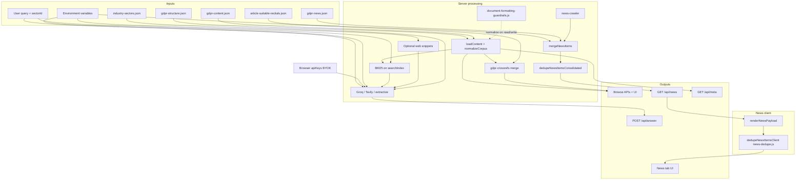

### 9.2 Configuration and ETL dependency chart

Which **environment knobs** influence **which subsystems** (simplified).

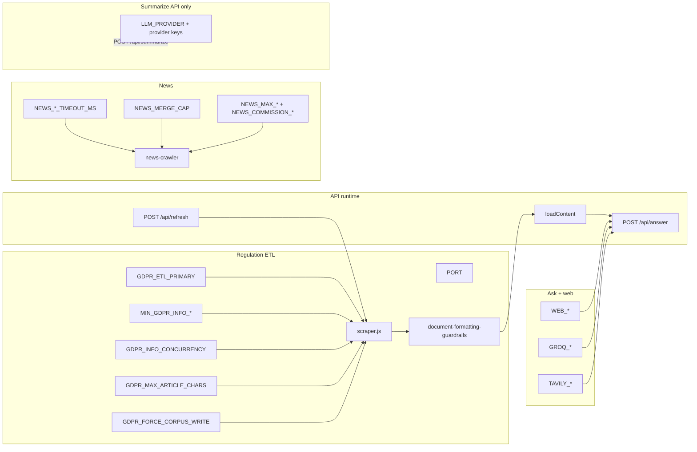

**Note:** **`NEWS_ATTACHMENTS_*`** variables configure the in-memory cache for **`/api/news/article-attachments`** and related batch summary routes in **`server.js`** (they do not change crawler behavior).

### 9.3 News deduplication (URL + semantic)

Consolidated dedupe is a **paired** server and client behavior; keep **`news-crawler.js`** and **`public/news-dedupe.js`** in sync when changing rules.

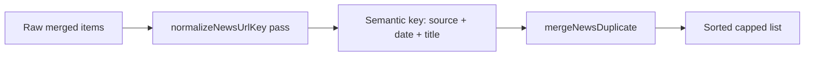

### 9.4 News topic assignment (post-gate)

After **`crawlNews`** returns a deduplicated list, each row passes **`newsItemMatchesApprovedTopic`** (which may use **`newsBlobMatchesTopicAnchor`** from **`news-topics.js`** as a supplemental relevance pass). Surviving rows receive **`topic`** and **`topicCategory`** via **`assignNewsTopicFields`** before the API serializes them.

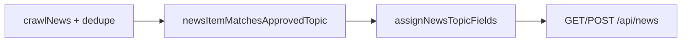

### 9.5 BYOK key resolution (Ask)

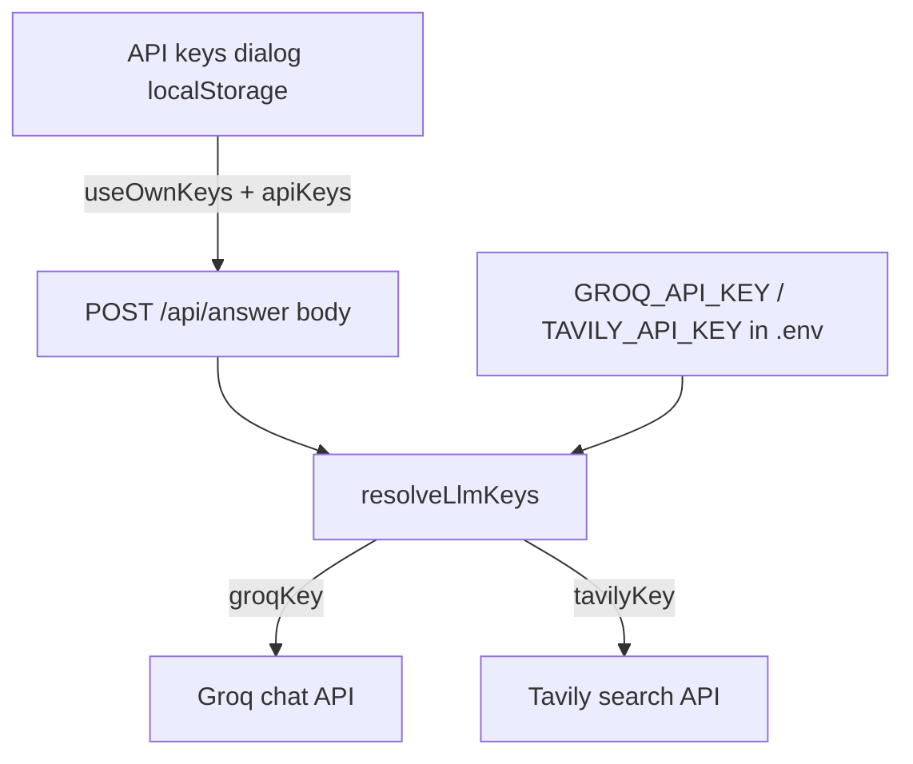

---

## 3b. EU AI Act content (`data/ai-act-content.json`)

| Technical name | Friendly name | Definition | Formula / rule | Location in app | Example |
|----------------|---------------|------------|----------------|-----------------|---------|
| `ai-act-content.json` | AI Act corpus file | Full AI Act text + search index. | Written by `ai-act-scraper.js`; read by `loadContent('ai-act')`. | `data/` | 113 articles |
| `meta.regulationId` | Corpus regulation tag | Identifies corpus in combined meta responses. | Constant **`ai-act`**. | `ai-act-content.json` → `meta` | `"ai-act"` |
| `hasArticleTopics` | Topic filter flag (client) | Whether sub-category filters show. | **`false`** for AI Act in `lib/regulations.js`. | API `/api/regulations` | `false` |
| `hasSuitableRecitals` | Cross-ref flag (client) | Whether suitable-recital panels load. | **`false`** for AI Act. | API `/api/regulations` | `false` |

---

## 10. Multi-regulation relationship (overview)

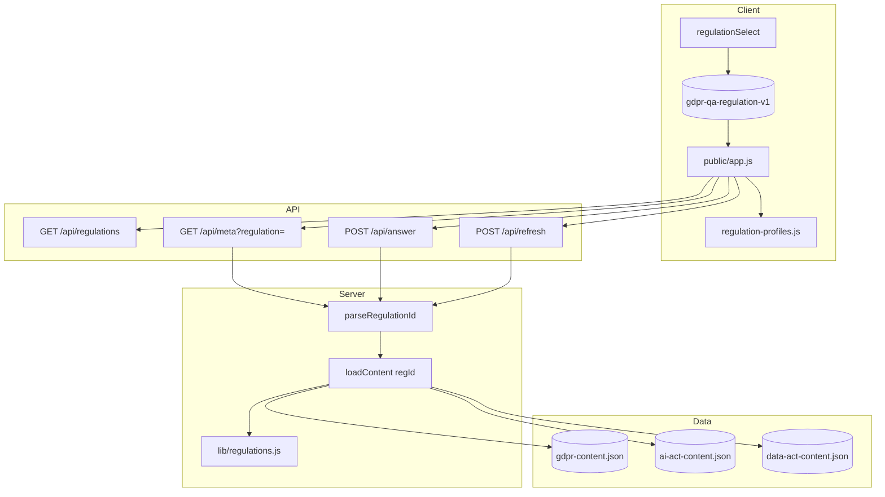

### 9.6 Browse display title resolution (by regulation)

How **article** and **recital** headings are chosen in the UI (must stay aligned with corpus `title` fields).

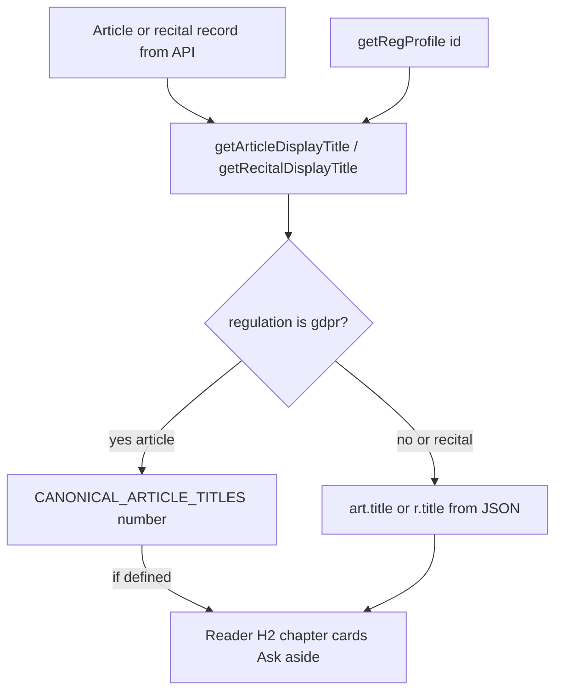

### 9.7 Regulation chrome and citation sidebar

How the **regulation selector** drives Browse copy, including the detail-view citation aside.

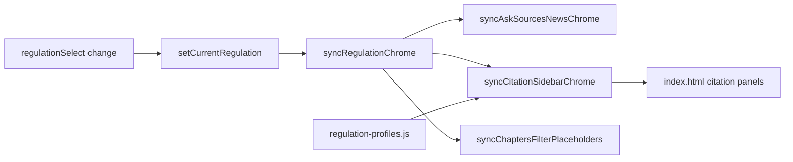

---

## 3c. EU Data Act content (`data/data-act-content.json`)

| Technical name | Friendly name | Definition | Formula / rule | Location in app | Example |
|----------------|---------------|------------|----------------|-----------------|---------|
| `data-act-content.json` | Data Act corpus file | Full Data Act text + search index. | Written by `data-act-scraper.js`; read by `loadContent('data-act')`. | `data/` | 50 articles |
| `meta.regulationId` | Corpus regulation tag | Identifies corpus in combined meta responses. | Constant **`data-act`**. | `data-act-content.json` → `meta` | `"data-act"` |
| `hasArticleTopics` | Topic filter flag (client) | Whether sub-category filters show. | **`false`** for Data Act in `lib/regulations.js`. | API `/api/regulations` | `false` |
| `hasSuitableRecitals` | Cross-ref flag (client) | Whether suitable-recital panels load. | **`false`** for Data Act. | API `/api/regulations` | `false` |

---

## 12. App chrome and responsive UI (CSS + client)

| Technical name | Friendly name | Definition | Formula / rule | Location in app | Example |
|----------------|---------------|------------|----------------|-----------------|---------|
| `--app-chrome-height` | Measured chrome height | Pixel height of `#appChrome` (header + tabs) used for reading-pane math. | Set by `ResizeObserver` + `syncAppChromeHeight()` in `initHeaderActionsToggle`; falls back to ~6–7.75rem in CSS. | `public/styles.css` `:root`; `document.documentElement` inline style | `112px` |
| `--app-shell-vertical` | Viewport reserved for chrome | Vertical space subtracted from `100dvh` for reading stacks. | `app-chrome-height + footer-block-min + main-vertical-pad` | `public/styles.css` | — |
| `#appChrome` | App chrome wrapper | Sticky container for header and tab bar on ≤899px. | `position: sticky; top: 0` in media query | `public/index.html` | — |
| `#headerActionsToggle` | Tools menu button | Expands/collapses `#headerActionsPanel` on mobile/tablet. | Hidden when `min-width: 900px` | `public/index.html`, `initHeaderActionsToggle` | `aria-expanded="true"` |
| `#headerActionsPanel` | Tools panel | Holds `.header-toolbar` (freshness, keys, refresh). | Class `is-open` when expanded (≤899px) | `public/index.html` | — |
| `#headerFreshnessHint` | Freshness toolbar subtitle | One-line status under “Source freshness” in Tools. | Updated by `syncHeaderToolbarStatus()` from `lastAppMeta` | `public/index.html` | `Content as of May 26, 2026…` |
| `#headerApiKeysHint` | API keys toolbar subtitle | One-line BYOK/server key state under “API keys”. | Updated by `syncHeaderToolbarStatus()` after `updateAskLlmKeysStatus()` | `public/index.html` | `Your keys active · Groq & Tavily` |
| `syncHeaderToolbarStatus` | Header status sync | Writes toolbar hints and ARIA labels; does **not** render duplicate status cards. | Called from `setMeta`, `updateAskLlmKeysStatus`, load errors | `public/app.js` | — |
| `lastAppMeta` | Cached meta for hints | Last `GET /api/meta` payload used for freshness subtitles. | Assigned in `syncHeaderToolbarStatus(meta)` | `public/app.js` | `{ lastRefreshed, lastChecked }` |
| `newsUi` | News hero copy profile | Per-regulation News hero: `theme`, `title`, `intro`, `tags`, `scopeMode`, `scopeText`, refresh labels. | Object on each profile in `REGULATION_PROFILES` | `public/regulation-profiles.js` | `theme: 'data-act'` |
| `syncNewsHeroChrome` | News hero binder | Applies `newsUi` to `#newsHero`, tags, scope card, refresh button. | Called from `syncAskSourcesNewsChrome` | `public/app.js` | — |

### 12.1 App chrome and toolbar status flow

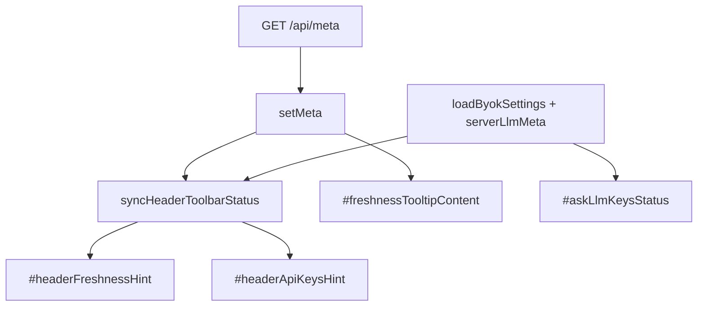

**Note:** Full freshness timestamps appear in the **tooltip**; long-form Ask key guidance appears on the **Ask tab** only (**BG-13** / **FR-SHELL-06**).

---

## 13. Browse welcome and chapters filters

| Technical name | Friendly name | Definition | Formula / rule | Location in app | Example |
|----------------|---------------|------------|----------------|-----------------|---------|
| `BROWSE_WELCOME_GRID_ORDER` | Desktop card order | Regulation ids rendered left-to-right on desktop. | `['gdpr', 'data-act', 'ai-act']` | `public/app.js` | GDPR left column |
| `#browseWelcomeGrid` | Desktop welcome grid | Three regulation overview cards (≥900px). | Built by `initBrowseWelcomeGrid()` once (`data-built="2"`). | `public/index.html` | — |
| `#browseWelcome` | Mobile welcome card | Single card for active regulation (&lt;900px). | `syncBrowseWelcomeSolo(reg)` | `public/index.html` | — |
| `syncBrowseWelcomeChrome` | Browse welcome sync | Initializes grid + solo card + active state. | Called from `syncRegulationChrome` | `public/app.js` | — |
| `data-browse-quick` | Quick segment action | `chapters` or `recitals` on grid card buttons. | `activateBrowseForRegulation(regId, seg)` | Grid card buttons | `chapters` |
| `loadChaptersRequestId` | Chapters load generation | Monotonic counter; stale responses discarded. | Incremented on each `loadChapters()` and `clearRegulationBrowseCaches()` | `public/app.js` | `3` |
| `resetChaptersFilters` | Reset chapter filters | Clears category, chapter, article, sub-category selects + combobox inputs. | Called on regulation change | `public/app.js` | — |
| `getChaptersFilterSubcategoryValue` | Effective sub-category filter | Returns sub-category value only when `hasArticleTopics`. | `''` for AI Act and Data Act | `applyChaptersFilters` | `''` |
| `normalizeChapterNumber` | Chapter number normalizer | Parses chapter id for filter matching. | `parseInt(value, 10)` or `null` | `applyChaptersFilters` | `3` |
| `#chaptersFiltersToggle` | Mobile filters control | Expands/collapses `#chaptersFiltersPanel` (≤899px). | `initChaptersFiltersPanelToggle` | Chapters browse | `aria-expanded` |
| `#chaptersFiltersPanel` | Filters panel container | Holds `.chapters-filters` bar. | Hidden by default on mobile | `public/index.html` | — |
| `#chaptersActiveFilters` | Active filters banner | Shows human-readable active filters + clear link. | `updateChaptersFiltersToggleMeta()` | Above article list | — |

### 13.1 Browse welcome and regulation switch flow

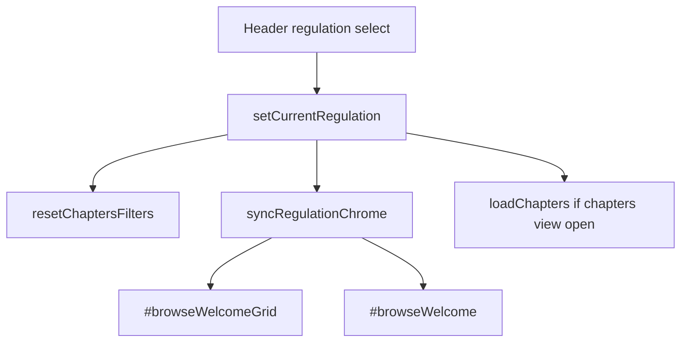

### 13.2 Chapters filter apply flow

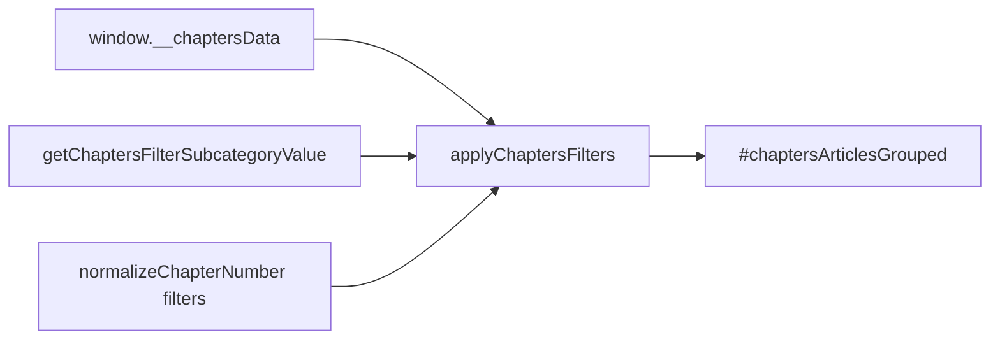

---

## 11. Maintenance checklist

1. **New environment variable:** Add a row to **§1**, update **[.env.example](../.env.example)**, **[README.md §10](../README.md#10-configuration)**, and **[API_CONTRACTS.md](API_CONTRACTS.md)** if user-visible. Update **§9.2** if it affects a major subsystem. **News dedupe rule changes:** update **§7**, **§9.1**, **§9.3**, **`public/news-dedupe.js`**, and **[GUARDRAILS.md](GUARDRAILS.md) TG-N04** together. **Commission / multi-feed crawl changes:** review **[GUARDRAILS.md](GUARDRAILS.md) TG-N06** and **[TRACEABILITY_MATRIX.md](TRACEABILITY_MATRIX.md)** news rows.
2. **JSON shape change** (regulation or news): Update **§2** / **§7**, **[PRD.md](PRD.md)**, and **[DOCUMENT_FORMATTING_GUARDRAILS.md](DOCUMENT_FORMATTING_GUARDRAILS.md)** or news merge notes as appropriate.
3. **New API field:** Update **[API_CONTRACTS.md](API_CONTRACTS.md)** and this dictionary.
4. **App chrome / News hero UI:** Update **§2.1** (`newsUi`), **§12**, **[DESIGN_GUIDELINES.md](DESIGN_GUIDELINES.md)**, **[FEATURE_CATALOG.md](FEATURE_CATALOG.md)**, and **[TRACEABILITY_MATRIX.md](TRACEABILITY_MATRIX.md)** BR-S-* / BR-*-N01 rows together.
5. **Browse welcome / chapters filters:** Update **§2.1** (`browseUi`), **§13**, PRD **FR-BRW-13–17**, feature **F-BRW-19–22**, design §2.2.1 together.
6. **Release:** Bump **`package.json`** version and **[CHANGELOG.md](../CHANGELOG.md)**; align **“Last updated”** notes in **[PRD.md](PRD.md)** when requirements change materially.
