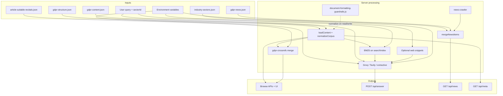
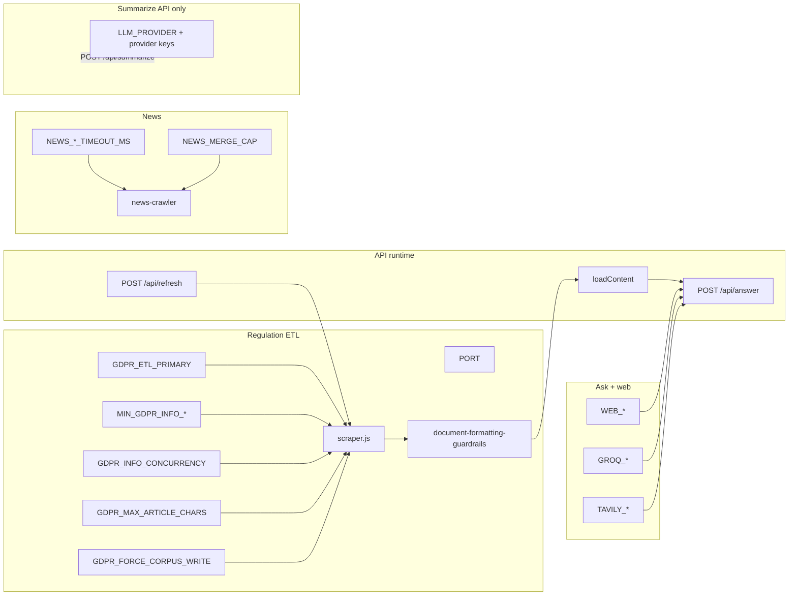

# Variables and data dictionary  
## GDPR Q&A Platform

**Purpose:** This document is the **authoritative data dictionary** for configuration keys, environment variables, persisted JSON fields, and derived quantities used across the product. Each entry uses consistent, reader-friendly wording.

**Column reference**

| Column | Meaning |
|--------|---------|
| **Technical name** | Identifier as it appears in code, JSON, or `.env`. |
| **Friendly name** | Short label for stakeholders and support. |
| **Definition** | What the value represents in business or system terms. |
| **Formula / rule** | How it is computed, parsed, or constrained (if applicable). |
| **Location in app** | Primary file, API, or UI surface. |
| **Example** | Illustrative value (never real secrets). |

**Related:** [README.md §10 Configuration](../README.md#10-configuration) · [.env.example](../.env.example) · [API_CONTRACTS.md](API_CONTRACTS.md) · [DOCUMENT_FORMATTING_GUARDRAILS.md](DOCUMENT_FORMATTING_GUARDRAILS.md)

---

## 1. Environment and server configuration

| Technical name | Friendly name | Definition | Formula / rule | Location in app | Example |
|----------------|---------------|------------|----------------|-----------------|---------|
| `PORT` | HTTP listen port | TCP port bound by the Express process. | Integer string; default **`3847`** when unset. | `server.js` → `app.listen` | `3847` |
| `GDPR_ETL_PRIMARY` | Regulation corpus source (primary) | Decides which extractor runs first on **Refresh sources** / ETL. | Case-insensitive: **`gdpr-info`** (default) or **`eur-lex`**. | `scraper.js` → `run()` | `gdpr-info` |
| `MIN_GDPR_INFO_ARTICLES` | Minimum article count (GDPR-Info acceptance) | Lower bound of parsed articles required to treat GDPR-Info as a successful primary pull. | `parseInt(env \|\| '99', 10)`; minimum **1**. | `scraper.js` | `99` |
| `MIN_GDPR_INFO_RECITALS` | Minimum recital count (GDPR-Info acceptance) | Same for recitals (full Regulation = 173). | `parseInt(env \|\| '173', 10)`; minimum **1**. | `scraper.js` | `173` |
| `GDPR_MAX_ARTICLE_CHARS` | Maximum stored characters per provision | Optional cap on article/recital body length when serializing (omit or high value = effectively uncapped). | Parsed integer; **0** or negative = no cap. | `scraper.js` → `capGdprBodyText` | `500000` |
| `GDPR_INFO_CONCURRENCY` | GDPR-Info fetch parallelism | Number of concurrent HTTP workers when fetching article and recital pages. | `max(1, parseInt(env \|\| '6', 10))`. | `scraper.js` → `fetchGdprInfoDataset` | `6` |
| `GDPR_FORCE_CORPUS_WRITE` | Force corpus disk write | When **`1`**, the next ETL run **writes** `gdpr-content.json` even if the content hash matches the previous file (recovery, guardrail-only updates). | Equality check to **`1`**. | `scraper.js` → `forceCorpusWrite` | `1` |
| `GDPR_FORCE_RELOAD_CORPUS` | Force reload flag (alias) | Same effect as **`GDPR_FORCE_CORPUS_WRITE`** for operators who prefer this name. | Equality check to **`1`**. | `scraper.js` | `1` |
| `NEWS_CRAWL_TIMEOUT_MS` | News read-path crawl budget | Maximum milliseconds to wait for a live crawl during **`GET /api/news`** before returning merged static + partial crawl. | `parseInt(env \|\| '75000', 10)`. | `server.js` | `75000` |
| `NEWS_REFRESH_TIMEOUT_MS` | News refresh-path crawl budget | Maximum wait for **`POST /api/news/refresh`**. | `parseInt(env \|\| '120000', 10)`. | `server.js` | `120000` |
| `NEWS_MERGE_CAP` | Merged news list cap (response) | Upper bound on item count returned to the client after merge (static + crawl). | `parseInt(env \|\| '520', 10)`. | `server.js` → news routes | `520` |
| `WEB_TIMEOUT_MS` | External HTTP timeout (Ask web context) | Timeout for DuckDuckGo HTML fetch and per-page excerpt retrieval. | `parseInt(env \|\| '12000', 10)`. | `server.js` → web helpers | `12000` |
| `WEB_MAX_RESULTS` | DuckDuckGo result rows | Maximum HTML result rows parsed from DuckDuckGo for Ask. | `parseInt(env \|\| '4', 10)`. | `server.js` | `4` |
| `WEB_MAX_PAGES` | Web excerpt page fetches | How many hit URLs are fetched for text excerpts. | `parseInt(env \|\| '3', 10)`. | `server.js` | `3` |
| `WEB_SNIPPET_CHARS` | Web excerpt character cap | Maximum characters retained per page excerpt after stripping. | `parseInt(env \|\| '1400', 10)`. | `server.js` | `1400` |
| `GROQ_API_KEY` | Groq API credential | Secret for OpenAI-compatible chat completions (**primary Ask synthesizer** and chapter-summary regeneration). | Loaded from `.env`; BOM stripped and trimmed on startup. | `server.js` | *(secret placeholder)* |
| `GROQ_MODEL` | Groq model list | One or more model identifiers tried in order for Ask and summarize paths. | Comma-separated list merged with built-in defaults. | `server.js` → `groqModelCandidates` | `llama-3.3-70b-versatile` |
| `TAVILY_API_KEY` | Tavily API credential | Enables **search + answer** fallback when Groq does not return usable text. | Optional; trimmed like Groq key. | `server.js` → `answerWithTavily` | *(optional secret)* |
| `TAVILY_SEARCH_DEPTH` | Tavily search depth | API **`search_depth`** parameter. | One of **`basic`**, **`fast`**, **`advanced`**, **`ultra-fast`**; invalid values fall back to **`advanced`**. | Tavily request body | `advanced` |
| `TAVILY_INCLUDE_ANSWER` | Tavily synthesized answer mode | Controls **`include_answer`** in Tavily API. | **`advanced`**, **`basic`**, **`true`**, **`false`** (case-insensitive). | Tavily request | `advanced` |
| `TAVILY_MAX_RESULTS` | Tavily result ceiling | Upper bound on search results returned by Tavily. | Clamped to **\[3, 20\]**. | Tavily request | `6` |
| `TAVILY_INCLUDE_DOMAINS` | Tavily domain bias list | Comma-separated hostnames (no scheme) to bias search toward trusted domains. | Split and trimmed; passed as **`include_domains`** when non-empty. | Tavily request | `eur-lex.europa.eu,gdpr-info.eu` |
| `OPENAI_API_KEY` | OpenAI API credential | Used for **`POST /api/summarize`** (not the primary Ask tab path unless extended). | Standard API key string. | `server.js` → summarize | *(optional)* |
| `OPENAI_MODEL` | OpenAI model id | Model identifier for OpenAI summarize calls. | Default **`gpt-4o-mini`**. | `server.js` | `gpt-4o-mini` |
| `ANTHROPIC_API_KEY` | Anthropic API credential | Optional summarize provider. | Secret string. | `server.js` | *(optional)* |
| `ANTHROPIC_MODEL` | Anthropic model id | Default **`claude-3-5-sonnet-20241022`**. | String. | `server.js` | `claude-3-5-sonnet-20241022` |
| `GOOGLE_GEMINI_API_KEY` | Google Gemini credential | Optional summarize provider. | Secret string. | `server.js` | *(optional)* |
| `GOOGLE_GEMINI_MODEL` | Gemini model id | Default **`gemini-1.5-flash`**. | String. | `server.js` | `gemini-1.5-flash` |
| `MISTRAL_API_KEY` | Mistral API credential | Optional summarize provider. | Secret string. | `server.js` | *(optional)* |
| `MISTRAL_MODEL` | Mistral model id | Default **`mistral-small-latest`**. | String. | `server.js` | `mistral-small-latest` |
| `OPENROUTER_API_KEY` | OpenRouter API credential | Optional summarize provider (multi-model gateway). | Secret string. | `server.js` | *(optional)* |
| `OPENROUTER_MODEL` | OpenRouter model slug | Default **`anthropic/claude-3.5-sonnet`**. | String. | `server.js` | `anthropic/claude-3.5-sonnet` |
| `OPENROUTER_REFERRER` | OpenRouter HTTP Referer | Sent as **`HTTP-Referer`** on OpenRouter requests. | Default **`http://localhost:3847`** (override in production). | `server.js` | `https://your-domain.example` |
| `LLM_PROVIDER` | Summarize provider lock | Forces a single LLM provider for **`POST /api/summarize`** when set. | **`openai`**, **`anthropic`**, **`gemini`**, **`groq`**, **`mistral`**, **`openrouter`** (case-insensitive). | `server.js` → `summarizeWithLLM` | `groq` |

---

## 2. Regulation content (`data/gdpr-content.json`)

| Technical name | Friendly name | Definition | Formula / rule | Location in app | Example |
|----------------|---------------|------------|----------------|-----------------|---------|
| `meta.lastRefreshed` | Content as of (successful write) | Timestamp when the corpus was last **significantly** written from ETL (operator-facing “how fresh is binding text”). | ISO string set by scraper when `significant` merge/write occurs. | Header tooltip, `contentAsOf` on APIs | `2026-04-03T12:00:00.000Z` |
| `meta.lastChecked` | Last ETL execution time | When the scraper last completed a run, including “no hash change” runs. | ISO string; always updated on refresh attempt. | `GET /api/meta`, freshness UI | ISO datetime |
| `meta.etl` | ETL diagnostics blob | Structured metadata: primary source requested, fetch outcome, hashes, diff counts. | Populated by `scraper.js` `run()`. | `GET /api/meta`, refresh toast message | `{ "extractedFrom": "gdpr-info", "fetched": true, … }` |
| `meta.datasetHash` | Corpus fingerprint | SHA-256–based hash over normalized recital/article payloads for change detection. | `computeDatasetHash` in `scraper.js`. | Internal ETL | *(64-char hex)* |
| `meta.sources` | Credible sources catalog | Organizations and document links for the **Credible sources** tab. | Array of `{ name, url, description, documents[] }`. | `GET /api/meta` | EDPB, EUR-Lex, … |
| `articles[]` | Article records | Full text and metadata for Articles **1–99**. | `number`, `title`, `text`, `chapter`, `sourceUrl`, `eurLexUrl`, … | Browse, APIs, BM25 index | Article **17** |
| `recitals[]` | Recital records | Full text for Recitals **1–173**. | `number`, `title?`, `text`, URLs | Browse, APIs | Recital **50** |
| `searchIndex[]` | Retrieval index rows | Denormalized rows for BM25 and legacy search. | Built after **`normalizeCorpus`**; deduplicated by **`id`**. | `buildBm25Searcher`, `POST /api/ask` | `{ "id": "article-5", … }` |

---

## 3. Cross-references and editorial maps

| Technical name | Friendly name | Definition | Formula / rule | Location in app | Example |
|----------------|---------------|------------|----------------|-----------------|---------|
| `article-suitable-recitals.json` → `articles` | Editorial article→recitals map | GDPR-Info–style “suitable recitals” per article number. | Keys: article number strings; values: arrays of recital numbers. | `data/`; copied to `public/` on **`npm start`** | `"6": [45, 46, …]` |
| `citingMap` | Recitals citing articles (derived) | Inverse index from recital body text patterns to article numbers. | `buildRecitalsCitingArticlesMap(recitals)` in **`gdpr-crossrefs.js`**. | Server merge for `suitableRecitals` | Article **6** → set of recitals |
| `suitableRecitals` | Merged related recitals (API field) | Union of editorial map, citation extraction, and neighbor fallbacks. | `mergedSuitableRecitalsForArticle` | `GET /api/articles/:n` | `[1, 2, 3]` |
| `suitableArticles` | Merged related articles (API field) | Related articles for a recital detail view. | `mergedSuitableArticlesForRecital` | `GET /api/recitals/:n` | `[5, 6, 7]` |

---

## 4. Ask flow (`POST /api/answer`)

| Technical name | Friendly name | Definition | Formula / rule | Location in app | Example |
|----------------|---------------|------------|----------------|-----------------|---------|
| `query` | User question | Natural-language input for Ask. | Trimmed; required (**400** if empty). | Request body, prompts | `What is personal data under the GDPR?` |
| `includeWeb` | Live web context flag | Whether to add DuckDuckGo-derived snippets and page excerpts. | Default **`true`**; may be suppressed for certain “layperson / General” patterns. | Request body | `true` |
| `industrySectorId` | Industry / sector selector | Sector id from **`industry-sectors.json`** or **`GENERAL`**. | Resolved via **`resolveIndustrySector`**. | Ask combobox, prompts | `GENERAL` or `D` |
| `localSources` | Regulation context bundle | Top BM25 hits plus full excerpts from the corpus. | **`buildLocalContext`**: BM25 over **`searchIndex`**, title boost, optional sector query expansion. | Server (pre-LLM) | Up to **~10** items |
| `sources[].id` | Citation identifier | Stable label aligned with **`[Sn]`** tokens in the answer. | Typically **`S1`**, **`S2`**, … in merge order. | Response JSON, chips | `S1` |
| `llm.used` | Model output used | Whether a neural or Tavily synthesis path produced the answer body. | **`true`** if Groq or Tavily returned usable text. | Response **`llm`** | `true` |
| `llm.provider` | Active synthesizer id | **`groq`** or **`tavily`**. | Set by branch taken. | Ask status chip | `groq` |
| `llm.model` | Model or mode label | Groq model id or Tavily-specific label. | From provider metadata. | Ask status | `llama-3.3-70b-versatile` |

**BM25 (conceptual formula):** For document \(d\) and query term \(t\), scoring uses inverse document frequency and length-normalized term frequency with \(k_1 = 1.2\), \(b = 0.75\), and a **title boost** of **1.8** inside **`buildLocalContext`** (`server.js`).

---

## 5. Regulation refresh API (`POST /api/refresh`)

| Technical name | Friendly name | Definition | Formula / rule | Location in app | Example |
|----------------|---------------|------------|----------------|-----------------|---------|
| `formattingGuardrails` | Document formatting validation payload | Result of **`validateCorpusFormatting`** after **`normalizeCorpus`**. | `{ ok: boolean, checks: [{ id, ok, detail }], warnings: string[] }`. | JSON response to client; **`console.warn`** in browser | `ok: true`, `checks` length **≥ 6** |
| `success` | Refresh completed without throw | HTTP handler succeeded. | **`true`** on **200**. | Client refresh handler | `true` |
| `message` | Human-readable ETL summary | Short explanation of fetch / significance. | Built from **`meta.etl`**. | Freshness tooltip append | `Sources refreshed successfully…` |

---

## 6. Chapter summaries (`data/chapter-summaries.json`)

| Technical name | Friendly name | Definition | Formula / rule | Location in app | Example |
|----------------|---------------|------------|----------------|-----------------|---------|
| `summaries` | Per-chapter introduction text | Plain-language blurbs for Chapters **I–XI**. | Keys **`"1"`** … **`"11"`**; optional LLM generation. | `GET /api/chapter-summaries`, Browse | `"1": "GDPR Chapter I frames…"` |
| `source` | Summary provenance | How blurbs were produced. | **`file`**, **`inline-fallback`**, **`regenerated`**. | API metadata | `file` |
| `llm` | LLM-generated flag | Whether Groq produced the stored JSON. | Boolean. | API | `false` |

---

## 7. News (`data/gdpr-news.json`)

| Technical name | Friendly name | Definition | Formula / rule | Location in app | Example |
|----------------|---------------|------------|----------------|-----------------|---------|
| `newsFeeds[]` | News feed registry | Named crawl entry points and UI “jump to feed” list. | Merged with server defaults when empty. | News tab | EDPB, ICO, … |
| `items[]` | News item collection | Cached and/or static items merged with live crawl. | Deduped by **normalized URL**; sorted by **`date`** descending; capped. | `GET /api/news`, **`POST /api/news/refresh`** | `{ title, url, sourceName, … }` |

---

## 8. Frontend taxonomy (`public/app.js`)

| Technical name | Friendly name | Definition | Formula / rule | Location in app | Example |
|----------------|---------------|------------|----------------|-----------------|---------|
| `ARTICLE_TOPICS` | Sub-category topic taxonomy | Topic ids with keyword lists for chapter filters. | **`getArticleTopicIds`** scans title + excerpt. | Chapters filter UI | `{ id: 'consent', label: 'Consent', keywords: […] }` |
| `CANONICAL_ARTICLE_TITLES` | Canonical article title map | Fallback short titles when scraped titles are noisy. | Map keyed by article number. | Article headers, Ask aside | Art. **17** title |
| `CHAPTER_SUMMARY_FALLBACK` | Client-side chapter blurbs | Mirrors server fallback when API unavailable. | Static strings **1–11**. | Chapter cards | Same as server **`FALLBACK_CHAPTER_SUMMARIES`** |

---

## 9. Relationship diagrams

### 9.1 Data and retrieval flow (core product)

How major **inputs** connect to **processing** and **outputs**. Arrows indicate “feeds” or “constrains.”

### 9.2 Configuration and ETL dependency chart

Which **environment knobs** influence **which subsystems** (simplified).

---

## 10. Maintenance checklist

1. **New environment variable:** Add a row to **§1**, update **[.env.example](../.env.example)**, **[README.md §10](../README.md#10-configuration)**, and **[API_CONTRACTS.md](API_CONTRACTS.md)** if user-visible. Update **§9.2** if it affects a major subsystem.
2. **JSON shape change** (regulation or news): Update **§2** / **§7**, **[PRD.md](PRD.md)**, and **[DOCUMENT_FORMATTING_GUARDRAILS.md](DOCUMENT_FORMATTING_GUARDRAILS.md)** or news merge notes as appropriate.
3. **New API field:** Update **[API_CONTRACTS.md](API_CONTRACTS.md)** and this dictionary.
4. **Release:** Bump **`package.json`** version and **[CHANGELOG.md](../CHANGELOG.md)**; align **“Last updated”** notes in **[PRD.md](PRD.md)** when requirements change materially.
