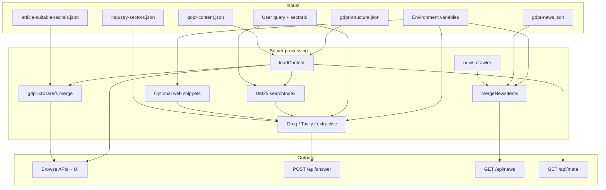

# Variables and data dictionary  
## GDPR Q&A Platform

This document catalogs **meaningful fields, configuration variables, and derived quantities** used across the product. For each entry: **technical name**, **friendly name**, **definition**, **formula or rule** (where applicable), **where it appears**, and an **example**.

For environment variables, see also [README.md §10 Configuration](../README.md#10-configuration) and [.env.example](../.env.example).

---

## 1. Environment and server configuration

| Technical name | Friendly name | Definition | Formula / rule | Location in app | Example |
|----------------|---------------|------------|----------------|-----------------|---------|
| `PORT` | HTTP listen port | TCP port for the Express server. | Integer; default `3847` if unset. | `server.js` (`app.listen`), deployment | `3847` |
| `GROQ_API_KEY` | Groq API credential | Secret for Groq OpenAI-compatible chat completions (primary Ask synthesizer). | Trimmed; BOM stripped on load. | `server.js` (`answerWithGroq`, `summarizeWithGroq`, chapter regeneration) | *(secret)* |
| `GROQ_MODEL` | Groq model selection | One or more model ids tried in order for Ask and summarize. | Comma-separated list merged with built-in defaults. | `server.js` (`groqModelCandidates`) | `llama-3.3-70b-versatile` |
| `TAVILY_API_KEY` | Tavily API credential | Fallback web search + answer when Groq returns nothing usable. | Optional. | `server.js` (`answerWithTavily`) | *(secret)* |
| `TAVILY_SEARCH_DEPTH` | Tavily search depth | API `search_depth` parameter. | `basic`, `fast`, `advanced`, `ultra-fast`; invalid → `advanced`. | Tavily request body | `advanced` |
| `TAVILY_INCLUDE_ANSWER` | Tavily answer field mode | Controls `include_answer` in Tavily API. | `advanced`, `basic`, `true`, `false`. | Tavily request | `advanced` |
| `TAVILY_MAX_RESULTS` | Tavily result cap | Upper bound on search results. | Clamped between 3 and 20. | Tavily request | `6` |
| `TAVILY_INCLUDE_DOMAINS` | Domain allowlist bias | Comma-separated hostnames to bias search. | Parsed to hostnames (no scheme/path). | Tavily optional `include_domains` | `eur-lex.europa.eu,gdpr-info.eu` |
| `NEWS_CRAWL_TIMEOUT_MS` | News read timeout | Max wait for live news crawl on `GET /api/news`. | `parseInt(env \|\| '75000', 10)` | `server.js` | `75000` |
| `NEWS_REFRESH_TIMEOUT_MS` | News refresh timeout | Max wait for crawl on `POST /api/news/refresh`. | `parseInt(env \|\| '120000', 10)` | `server.js` | `120000` |
| `NEWS_MERGE_CAP` | Merged news response cap | Max items returned to client after merge. | `parseInt(env \|\| '520', 10)` | Response slice | `520` |
| `WEB_TIMEOUT_MS` | External page fetch timeout | HTTP timeout for DuckDuckGo HTML and fetched pages. | `parseInt(env \|\| '12000', 10)` | `fetchWithTimeout` | `12000` |
| `WEB_MAX_RESULTS` | DuckDuckGo result count | Max HTML result rows parsed. | `parseInt(env \|\| '4', 10)` | `webSearchDuckDuckGo` | `4` |
| `WEB_MAX_PAGES` | Web excerpt fetches | How many hit URLs to fetch for excerpts. | `parseInt(env \|\| '3', 10)` | `fetchWebSnippets` | `3` |
| `WEB_SNIPPET_CHARS` | Web excerpt length | Max characters per page excerpt after strip. | `parseInt(env \|\| '1400', 10)` | `chunkExcerpt` for web | `1400` |
| `LLM_PROVIDER` | Summarize provider lock | Forces a single provider for `POST /api/summarize`. | Enum: `openai`, `anthropic`, `gemini`, `groq`, `mistral`, `openrouter`. | `summarizeWithLLM` | `groq` |
| `OPENAI_API_KEY`, `ANTHROPIC_API_KEY`, `GOOGLE_GEMINI_API_KEY`, `MISTRAL_API_KEY`, `OPENROUTER_API_KEY` | Optional summarize providers | Used only by `/api/summarize` (not the main Ask tab). | First available when `LLM_PROVIDER` unset follows priority in code. | `server.js` summarize functions | *(optional secrets)* |

---

## 2. Regulation content (`data/gdpr-content.json`)

| Technical name | Friendly name | Definition | Formula / rule | Location | Example |
|----------------|---------------|------------|----------------|----------|---------|
| `meta.lastRefreshed` | Content as of | Timestamp when regulation corpus was last successfully written from ETL. | Set by scraper on successful write. | Header tooltip (“Content as of”), API `contentAsOf` | `"2025-03-15T10:00:00.000Z"` |
| `meta.lastChecked` | Last ETL check | When scraper last ran (even if no significant change). | Set by scraper. | `/api/meta`, freshness UI | ISO datetime |
| `meta.etl` | ETL diagnostics | Optional blob describing last fetch/merge. | Scraper-defined. | `/api/refresh` message | `{ fetched: true, significant: true, … }` |
| `meta.sources` | Source catalog | Organizations and document links for Credible sources. | Array of `{ name, url, description, documents[] }`. | `GET /api/meta`, Sources tab | EDPB, EUR-Lex, … |
| `articles[]` | Article records | Full text of Articles 1–99. | `number`, `title`, `text`, `chapter`, URLs as scraped. | Browse, APIs, search index | `article-17` |
| `recitals[]` | Recital records | Full text of Recitals 1–173. | `number`, `text`, URLs. | Browse, APIs | `recital-58` |
| `searchIndex[]` | Search index entries | Denormalized rows for BM25 / legacy search. | Built in scraper; deduped by `id`. | `buildBm25Searcher`, `simpleSearch` | `{ type, number, title, text, … }` |

---

## 3. Cross-references and editorial maps

| Technical name | Friendly name | Definition | Formula / rule | Location | Example |
|----------------|---------------|------------|----------------|----------|---------|
| `article-suitable-recitals.json` → `articles` | Editorial article→recitals | GDPR-Info–style suitable recitals per article. | Key: article number string; value: number[]. | `data/` + copied to `public/` on `prestart`; `gdpr-crossrefs.js` | `"17": [65, 66, …]` |
| `citingMap` | Recitals citing article | Inverse index: which recital bodies mention which articles. | `buildRecitalsCitingArticlesMap(recitals)` parses “Article n” patterns (filters TFEU/Directive noise). | `server.js`, `gdpr-crossrefs.js` | Article 6 → set of recital numbers |
| `suitableRecitals` | Merged related recitals | Shown on article API response. | `mergedSuitableRecitalsForArticle(num, editorial, citingMap)` with neighbor fallback. | `GET /api/articles/:n`, Browse sidebar | Array of integers |
| `suitableArticles` | Merged related articles | Shown on recital API response. | `mergedSuitableArticlesForRecital(num, editorial, text)` | `GET /api/recitals/:n` | Array of integers |

---

## 4. Ask flow (`POST /api/answer`)

| Technical name | Friendly name | Definition | Formula / rule | Location | Example |
|----------------|---------------|------------|----------------|----------|---------|
| `query` | User question | Raw question string. | Trimmed; required. | Request body, prompts | `"What is personal data?"` |
| `includeWeb` | Include live web | Whether to fetch DuckDuckGo snippets and page excerpts. | Default `true`; skipped for some “layperson” General queries. | Request body | `true` |
| `industrySectorId` | Sector selector | Id from `industry-sectors.json` or `GENERAL`. | `resolveIndustrySector(body.industrySectorId)` | Ask UI combobox, prompts | `GENERAL` or `D` |
| `localSources` | Regulation context pack | Top BM25 hits from corpus + full excerpts. | `buildLocalContext`: BM25 on `searchIndex`, article/recital mix, sector query expansion. | Server before LLM | Up to 10 items |
| `sources[].id` | Source citation id | Stable label for answer citations. | `S${idx+1}` in order of combined list (regulation + web). | Response; `[S1]` in answer text | `S1`, `S2` |
| `llm.used` | LLM engaged flag | Whether a model produced the answer. | `true` if Groq or Tavily returned text. | Response `llm` object | `true` |
| `llm.provider` | LLM provider id | `groq` or `tavily`. | Set by code path taken. | Status chip in Ask UI | `groq` |
| `llm.model` | Model or mode label | Groq model id or Tavily mode string. | From API response metadata. | Ask status | `llama-3.3-70b-versatile` |

**BM25 scoring (conceptual):** For each document \(d\) and query term \(t\), term score uses IDF and length-normalized TF with parameters \(k_1=1.2\), \(b=0.75\), and title boost \(1.8\) in `buildLocalContext`. Implementation: `buildBm25Searcher` in `server.js`.

---

## 5. Chapter summaries (`data/chapter-summaries.json`)

| Technical name | Friendly name | Definition | Formula / rule | Location | Example |
|----------------|---------------|------------|----------------|----------|---------|
| `summaries` | Per-chapter blurbs | Plain-English intro for Chapters 1–11. | Keys `"1"`…`"11"`; LLM-generated or fallback inline. | `GET /api/chapter-summaries`, Browse | `"1": "GDPR Chapter I frames…"` |
| `source` | Provenance | How summaries were produced. | `file`, `inline-fallback`, `regenerated`. | API metadata | `file` |
| `llm` | LLM generated flag | Whether JSON came from Groq. | Boolean. | API | `true` |

---

## 6. News (`data/gdpr-news.json`)

| Technical name | Friendly name | Definition | Formula / rule | Location | Example |
|----------------|---------------|------------|----------------|----------|---------|
| `newsFeeds[]` | Feed registry | Named entry points for crawlers and UI. | Merged with `DEFAULT_NEWS_FEEDS` if empty. | News tab “Jump to a feed” | EDPB, ICO, … |
| `items[]` | News items | Static and/or cached crawl results. | Merged with live crawl by normalized URL key; sort by `date` desc; cap. | `GET /api/news`, `POST /api/news/refresh` | `{ title, url, sourceName, date, … }` |

---

## 7. Frontend taxonomy (`public/app.js`)

| Technical name | Friendly name | Definition | Formula / rule | Location | Example |
|----------------|---------------|------------|----------------|----------|---------|
| `ARTICLE_TOPICS` | Sub-category topics | Topic ids with keyword matchers. | `getArticleTopicIds` scans title + text prefix. | Chapters filter “Sub-category” | `{ id: 'consent', label: 'Consent', keywords: [...] }` |
| `CANONICAL_ARTICLE_TITLES` | Display title fallback | Official short titles for Articles 1–99. | Map by article number when scraped title unusable. | Article headers, Ask relevant list | Article 17 → “Right to erasure…” |
| `CHAPTER_SUMMARY_FALLBACK` | Client chapter blurbs | Mirrors server fallback if API fails. | Static strings 1–11. | Chapter headers in UI | Same text as server `FALLBACK_CHAPTER_SUMMARIES` |

---

## 8. Relationship diagram (variables and data flow)

The diagram shows how major **inputs** connect to **processing** and **outputs**. Arrows read as “feeds” or “constrains.”

---

## 9. Maintenance

- When adding a new **environment variable**, append a row to **§1** and update [.env.example](../.env.example), [README.md §10](../README.md#10-configuration), and [API_CONTRACTS.md](API_CONTRACTS.md) if behavior is user-visible.
- When changing **JSON shapes** for regulation or news, update this file and [DOCUMENT_FORMATTING_GUARDRAILS.md](DOCUMENT_FORMATTING_GUARDRAILS.md) or news merge docs as appropriate.
