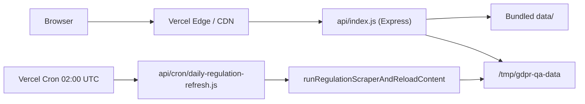

# Deploying to Vercel (production)

**Version:** 1.3 · **Last updated:** 2026-07-22 · Documentation standard **v2.4** · Product **1.2.5**

This guide covers deploying the EU Regulation Q&A Platform as a **Vercel serverless** Node app. Local development (`npm start`) is unchanged.

---

## Architecture on Vercel

| Component | Local | Vercel |
|-----------|-------|--------|
| HTTP server | `app.listen()` in `server.js` | `api/index.js` exports the Express app |
| Static SPA | `public/` via Express | Same (rewritten to `/api`) |
| Regulation data | `data/*.json` (read/write) | Bundled `data/` (read-only) + writable copy under `/tmp/gdpr-qa-data` per instance |
| Daily ETL cron | `node-cron` in `server.js` | [Vercel Cron](https://vercel.com/docs/cron-jobs) → `api/cron/daily-regulation-refresh.js` |



---

## Prerequisites

1. [Vercel account](https://vercel.com) and [Vercel CLI](https://vercel.com/docs/cli) (optional).
2. GitHub repo connected to Vercel (recommended) or `vercel` CLI from this directory.
3. **Node ≥ 18** (set in Project → Settings → General if needed).
4. **Pro plan** (or equivalent) if you need function durations above **10 seconds** (Hobby limit). This app sets `maxDuration: 300` for regulation refresh and long news crawls.

---

## One-time setup

### 1. Import project

- **Root directory:** repository root (`gdpr-qa-platform` if monorepo subfolder).
- **Framework preset:** Other (no framework auto-detection).
- **Build command:** `npm run vercel-build` (copies `article-suitable-recitals.json` into `public/`).
- **Install command:** `npm install`.
- **Output directory:** leave empty (serverless, not static export).

`vercel.json` in the repo already configures rewrites, function limits, `includeFiles: data/**`, and the daily cron schedule.

### 2. Environment variables

Set in **Project → Settings → Environment Variables** for **Production** (and Preview if desired):

| Variable | Required | Purpose |
|----------|----------|---------|
| `GROQ_API_KEY` | Recommended | Server-side Ask LLM (users can still use BYOK) |
| `TAVILY_API_KEY` | Optional | Tavily fallback when Groq fails |
| `CRON_SECRET` | **Required for cron** | Vercel sends `Authorization: Bearer <CRON_SECRET>` to cron routes |
| `OPENROUTER_REFERRER` | Recommended | Set to your production URL (e.g. `https://your-app.vercel.app`) |

Optional tuning: same keys as `.env.example` (`NEWS_*`, `GDPR_*`, `WEB_*`, other LLM providers).

**Do not** commit `.env` or paste secrets into the repository.

### 3. Deploy

```bash
cd gdpr-qa-platform
npx vercel          # preview
npx vercel --prod   # production
```

Or push to `main` with Git integration.

---

## What works in production

- Full SPA: Browse, Ask (BM25 + Groq/Tavily), BYOK, News (read bundled/cached JSON), Credible sources, PDF export.
- `GET /api/meta`, health-style routes, validation `POST /api/validate-api-keys`.
- **Ask** with server keys and/or user BYOK keys.

## Limitations (important)

1. **Ephemeral writes** — On Vercel, JSON writes (regulation refresh, news refresh, chapter summaries) go to `/tmp/gdpr-qa-data`. That storage is **per serverless instance** and **not shared** across instances; it can be cleared on cold start. Production should rely on **committed `data/` in the repo** (or run `npm run refresh` locally and push updated JSON until external storage is added).
2. **Long operations** — `POST /api/news/refresh` and regulation ETL can exceed Hobby timeouts. Use Pro + `maxDuration` in `vercel.json`, or refresh data offline and redeploy.
3. **Cron** — Daily regulation refresh at **02:00 UTC** (`0 2 * * *`) updates `/tmp` on the cron invocation only; it does not update the git bundle. Use cron for keeping instances warm-ish with fresh ETL when acceptable; for authoritative corpus updates, refresh locally and commit `data/gdpr-content.json`.
4. **BYOK** — Keys stay in the browser; they are sent to your Vercel deployment over HTTPS only when the user asks or validates keys.

---

## Cron job

- **Path:** `/api/cron/daily-regulation-refresh`
- **Schedule:** `0 2 * * *` (see `vercel.json`)
- **Auth:** `CRON_SECRET` must match `Authorization: Bearer …` (Vercel sets this automatically when `CRON_SECRET` is configured).

Manual test (replace values):

```bash
curl -X GET "https://YOUR_DEPLOYMENT.vercel.app/api/cron/daily-regulation-refresh" \
  -H "Authorization: Bearer YOUR_CRON_SECRET"
```

---

## Files added for Vercel

| File | Role |
|------|------|
| `vercel.json` | Rewrites, function config, crons |
| `api/index.js` | Serverless entry → Express `app` |
| `api/cron/daily-regulation-refresh.js` | Cron handler |
| `lib/paths.js` | `getDataDir()` — bundle vs `/tmp`; **`SEED_FILES`** manifest (11 JSON files) |
| `.vercelignore` | Exclude `.env`, logs |

---

## Seed manifest (`SEED_FILES`)

On first access per serverless instance, `lib/paths.js` copies these files from bundled `data/` into `/tmp/gdpr-qa-data` **only when the destination file is missing**:

| # | File | Purpose |
|---|------|---------|
| 1 | `gdpr-content.json` | GDPR corpus |
| 2 | `gdpr-structure.json` | GDPR structure + sources |
| 3 | `ai-act-content.json` | AI Act corpus |
| 4 | `ai-act-structure.json` | AI Act structure |
| 5 | `data-act-content.json` | Data Act corpus |
| 6 | `data-act-structure.json` | Data Act structure |
| 7 | `gdpr-news.json` | News feeds + items |
| 8 | `chapter-summaries.json` | GDPR chapter intros |
| 9 | `chapter-summaries-ai-act.json` | AI Act chapter intros |
| 10 | `chapter-summaries-data-act.json` | Data Act chapter intros |
| 11 | `article-suitable-recitals.json` | GDPR editorial crossrefs |

Override writable root with `GDPR_DATA_DIR`. After deploy, verify `GET /api/regulations` lists all three regulations and `GET /api/meta?regulation=data-act` returns metadata.

---

## Troubleshooting

| Symptom | Likely cause |
|---------|----------------|
| 504 on Ask / refresh | Function timeout; upgrade plan or reduce crawl scope |
| Empty regulation after deploy | Missing `data/gdpr-content.json` in repo; run `npm run refresh` locally and commit |
| Cron 401 | `CRON_SECRET` missing or mismatch |
| Attachments / news stale | Instance using bundled JSON; run local news refresh and commit `data/gdpr-news.json` |

---

## Related docs

- [README.md](../README.md) — Quick start (local)
- [ARCHITECTURE.md](ARCHITECTURE.md) — System overview
- [GUARDRAILS.md](GUARDRAILS.md) — BG-08 / TG limits for BYOK and hosting
